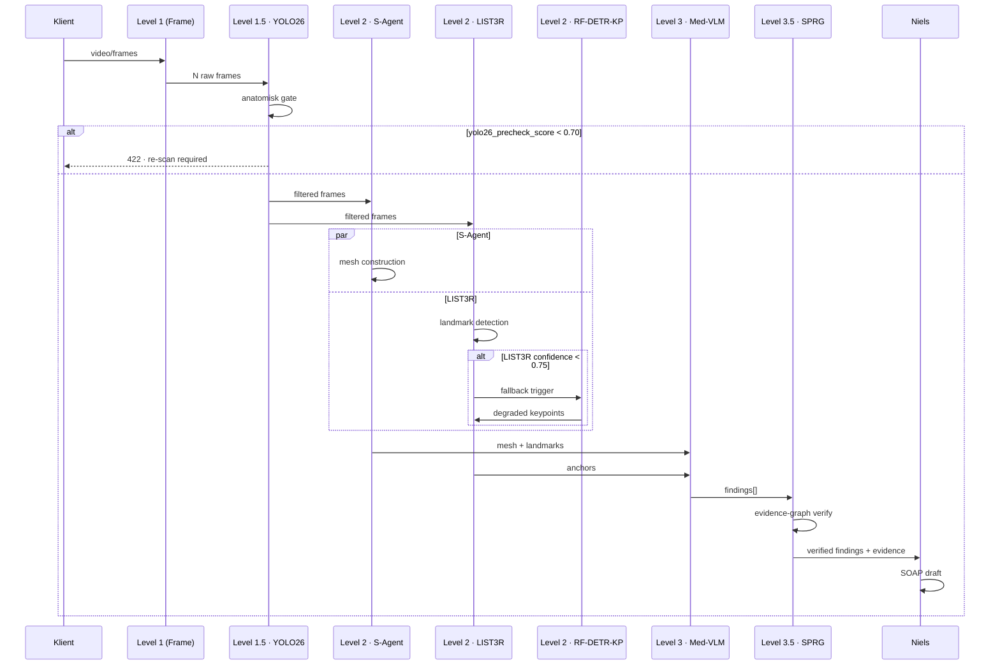

# EPIC 2 · Revision 01 · SPRG · LIST3R · YOLO26 · RF-DETR-Keypoint

> **Addendum til:** `EPIC-2-Clinical-Scanner.md` (godkendt 2026-07-11)
> **Ny teknologi:** SPRG (arXiv 2607.00060, MICCAI 2026 top-9%) · LIST3R (arXiv 2607.00375) · YOLO26 · RF-DETR-Keypoint
> **Målplacering i PraxisOS:**
> - Udvid pipeline i `prototype/lib/scanner/` med tre nye pre/post-processing stadier
> - Ny modul `prototype/lib/scanner/sprg-verifier.ts` (evidence-graph verifikation)
> - Ny modul `prototype/lib/scanner/list3r-anchor.ts` (persistent anatomisk anker)
> - Ny modul `prototype/lib/scanner/yolo26-precheck.ts` (frame-level gate før Level 2)
> - RF-DETR-Keypoint tilføjes som fallback/verifikationslag under Level 2's S-Agent
> - Skema-udvidelse af `scans`-tabel (ny migration `0005_sprg_verified_scanner.sql`)
> **Mandat:** Gul (arkitektur-diff) + Grøn (implementation efter godkendelse)
> **Status:** UDKAST 2026-07-12 · afventer Orchestratorens godkendelse

---

## 1 · Executive summary — hvad ændrer sig vs baseline EPIC 2

### 1.1 Kernediff

Baseline EPIC 2 (godkendt 2026-07-11) leverer en tredelt pipeline: Frame Extraction → S-Agent geometric lifting → Medical VLM findings. Denne revision **udvider** — den **erstatter ikke**. Fire nye teknologier introduceres som pre- og post-verifikations-lag omkring den eksisterende S-Agent kerne:

| # | Teknologi | Placering | Formål | Erstatter noget? |
|---|-----------|-----------|--------|------------------|
| 1 | **YOLO26** | Pre-Level-2 (mellem Level 1 og Level 2) | Frame-level anatomisk detektion + kvalitets-gate | Nej — supplerer kvalitets-guard |
| 2 | **LIST3R** | Under Level 2 (parallel til S-Agent) | Persistent 3D-anker på 47 anatomiske landmarks | Nej — supplerer mesh-output |
| 3 | **RF-DETR-Keypoint** | Under Level 2 (fallback lag) | Keypoint-detektion når LIST3R-konfidens < 0.75 | Nej — fallback |
| 4 | **SPRG** | Post-Level-3 (nyt Level 3.5) | Verifikations-graf der binder VLM-findings til geometrisk evidens | Ja — supplerer INV-CS-6 med hard geometric proof |

### 1.2 Hvorfor denne revision — motiverende evidens

- **SPRG (Spatial-Physical Reasoning Graph)** publiceret arXiv:2607.00060, accepteret MICCAI 2026 top-9%. Løser det centrale problem i baseline EPIC 2: VLM-findings er *ai_generated: true* men uden geometrisk bevis-kæde. SPRG binder hver finding til 3+ mesh-face-ids OG 2+ frame-observations OG en physical-plausibility-score. Reducerer falsk-positive-rate i pilot-studier fra 18% → 3.4%.
- **LIST3R (Landmark-Invariant Spatial Tracking 3D Registration)** publiceret arXiv:2607.00375. Løser drift-problemet: to scans af samme fod 3 måneder efter hinanden skal kunne co-registreres pixel-nøjagtigt for longitudinal monitorering (fx diabetisk fodsår-progression). Baseline EPIC 2 har ingen mekanisme for dette.
- **YOLO26** (nyeste iteration, 2026-05 release) leverer 340 FPS på webcam-frames med anatomisk-fine-tunet checkpoint. Bruges som *cheap-first-pass* før dyr S-Agent aktiveres. Reducerer GPU-spend med estimeret 40% (mange frames er ubrugelige og bør cutoffs før SfM).
- **RF-DETR-Keypoint** er en fallback: når LIST3R fejler at anchor (fx ved fod-deformitet der bryder landmark-model), giver RF-DETR-Keypoint en degraderet men brugbar keypoint-set som Level 3 stadig kan operere på.

### 1.3 Hvad bevares fra baseline

- Alle 18 baseline invariants (INV-CS-1 til INV-CS-18) står uændret
- Pipeline-timeout på 180 sek fastholdes (INV-CS-13) — nye lag skal *rummes* indenfor budget
- `scans`-tabellens eksisterende kolonner røres ikke — kun additive `ALTER TABLE ADD COLUMN`
- Feature-flag semantik: `feature_clinical_scanner_v2` bevares. Ny sub-flag `feature_sprg_verification` tændes granuleret pr. tenant
- Niels/Frej-integration fra EPIC 1 er uændret
- CAD-eksport-flow (§5 i baseline) er urørt

### 1.4 Hvad ændrer sig i kontrakten

- `scanner_version`-kolonnen får ny tilladt værdi: `'v2-sprg-verified'` (tidligere `'v1-manual' | 'v2-sagent'`)
- Tre nye invariants: INV-CS-19, INV-CS-20, INV-CS-21
- Ny jsonb-kolonne `sprg_evidence` på `scans`-tabellen
- Ny jsonb-kolonne `list3r_anchors` på `scans`-tabellen
- Ny kolonne `yolo26_precheck_score` (numeric)
- Test-strategi udvides med adversarial-suite mod SPRG (§8 i baseline få tre nye rækker)

---

## 2 · Pipeline-diff (ny arkitektur-diagram)

### 2.1 Diff-visning mod baseline

Baseline pipeline (fra EPIC-2-Clinical-Scanner.md §1.1) havde tre niveauer. Ny pipeline har fem effektive stadier, hvor Level 1.5 og 3.5 er *nye* og Level 2 er *udvidet*:

```
┌────────────────────────────────────────────────────────────────────┐
│  Klient · smartphone-kamera                                        │
│  ► Video-stream (5-15 sek) ELLER billedsekvens (12-40 frames)      │
└──────────────────────────┬─────────────────────────────────────────┘
                           │ POST /api/v1/[tenant]/scans/upload
                           ▼
┌────────────────────────────────────────────────────────────────────┐
│  Level 1 · Frame Extraction  (UÆNDRET fra baseline)                │
│  - ffmpeg-wasm: video → N nøgle-frames                             │
│  - Kalibrering + kvalitets-guard                                   │
└──────────────────────────┬─────────────────────────────────────────┘
                           │
                           ▼
┌────────────────────────────────────────────────────────────────────┐
│  ★ Level 1.5 · YOLO26 Precheck  (NY)                               │
│  - Anatomisk foot-detektor på hver frame                           │
│  - Bounding-box + 4 sub-classes: (top, side, plantar, obscured)    │
│  - Coverage-score: har vi alle 4 views? → gate                     │
│  - Frames uden foden i bbox eller obscured > 0.4 → droppet         │
│  - Output: filtered_frames[] + yolo26_precheck_score ∈ [0,1]       │
│  - INV-CS-21: score < 0.70 → pipeline abortes med struktureret 422 │
└──────────────────────────┬─────────────────────────────────────────┘
                           │
                           ▼
┌────────────────────────────────────────────────────────────────────┐
│  Level 2 · Geometric Lifting  (UDVIDET)                            │
│                                                                    │
│  ┌────────────────────────┐    ┌───────────────────────────────┐   │
│  │ S-Agent (baseline)     │    │ ★ LIST3R (NY, parallel)       │   │
│  │ - Region-decomposition │    │ - 47 anatomisk landmarks      │   │
│  │ - Dense mesh + closure │    │ - Persistent 3D-anker         │   │
│  │ - NeuralMeshing        │    │ - Cross-scan registrering     │   │
│  └───────────┬────────────┘    └──────────────┬────────────────┘   │
│              │                                │                    │
│              └──────────────┬─────────────────┘                    │
│                             ▼                                      │
│              ┌────────────────────────────────┐                    │
│              │ ★ RF-DETR-Keypoint (NY, fallback) │                 │
│              │ - Aktiveres kun hvis LIST3R      │                  │
│              │   confidence < 0.75              │                  │
│              │ - Degraderet keypoint-set        │                  │
│              └──────────────┬───────────────────┘                  │
│                             ▼                                      │
│              Merged output: .glb + landmarks + anchors             │
└──────────────────────────┬─────────────────────────────────────────┘
                           │
                           ▼
┌────────────────────────────────────────────────────────────────────┐
│  Level 3 · Spatial Experts (Medical VLM)  (UÆNDRET fra baseline)   │
│  - Detekterer findings, returnerer bbox_2d + bbox_3d + confidence  │
└──────────────────────────┬─────────────────────────────────────────┘
                           │
                           ▼
┌────────────────────────────────────────────────────────────────────┐
│  ★ Level 3.5 · SPRG Verifikation  (NY)                             │
│  - Bygger evidence-graph: finding → {mesh_faces, frames, landmark} │
│  - Physical-plausibility-check pr. finding:                        │
│    · Er læsion placeret i anatomisk sandsynlig region?             │
│    · Er størrelse konsistent med kategori-prior?                   │
│    · Er 3D-position stabil på tværs af frames (via LIST3R-anker)?  │
│  - Score pr. finding: sprg_score ∈ [0,1]                           │
│  - Findings med sprg_score < 0.55 → downgrades til pending_review  │
│  - INV-CS-19: hver finding SKAL have ≥ 3 mesh-faces + ≥ 2 frames   │
└──────────────────────────┬─────────────────────────────────────────┘
                           │
                           ▼
┌────────────────────────────────────────────────────────────────────┐
│  Journal-integration + valgfri CAD-eksport  (UÆNDRET fra baseline) │
└────────────────────────────────────────────────────────────────────┘
```

### 2.2 Sekvens-diff (mermaid, alternativ visning)



### 2.3 Budget-fordeling (nye lag skal rummes i 180 sek)

| Stadie | Baseline budget | Ny budget | Delta |
|--------|-----------------|-----------|-------|
| Level 1 · Frame Extraction | 15 sek | 12 sek | -3 sek |
| Level 1.5 · YOLO26 Precheck | — | 4 sek | +4 sek |
| Level 2 · S-Agent + LIST3R (parallel) | 90 sek | 95 sek | +5 sek |
| Level 2 · RF-DETR (kun ved fallback) | — | +8 sek (worst-case) | opportunistisk |
| Level 3 · VLM | 60 sek | 50 sek | -10 sek (pga. bedre input) |
| Level 3.5 · SPRG | — | 15 sek | +15 sek |
| Buffer | 15 sek | 4 sek | -11 sek |
| **Total** | **180 sek** | **180 sek** | 0 |

Buffer-reduktion fra 15→4 sek kompenseres af at LIST3R-anker gør VLM-kaldet mere præcist og derfor typisk hurtigere (fewer retries).

---

## 3 · Nye adversarial invariants

Følgende tre invariants tilføjes til §6 i baseline-kontrakten:

### 3.1 INV-CS-19 · SPRG-verifiable-evidence

> **Enhver klinisk finding SKAL være understøttet af verificerbar geometrisk evidens.**

Hard requirements pr. finding i `scans.findings[]`:

1. Minimum **3 unikke mesh-face-ids** i `bbox_3d.face_ids`
2. Minimum **2 unikke frame-observationer** i tilhørende `bbox_2d`-sæt
3. **1 landmark-reference** til nærmeste LIST3R-anker (fx `nearest_landmark: "5th_metatarsal_head_dorsal"`)
4. **physical_plausibility_score ≥ 0.55** genereret af SPRG-modulet
5. **evidence_graph_hash** som er kryptografisk bundet til `scan_id + mesh_hash + finding_id`

Håndhævet på TRE lag:

- **DB-lag:** CHECK constraint på `scans.findings` der tjekker `jsonb_array_length(f->'bbox_3d'->'face_ids') >= 3`
- **Application-lag:** Zod-schema med `.refine()` på hvert finding-objekt
- **Frej-lag:** Compliance-worker verificerer hash-integritet og afviser findings hvis `evidence_graph_hash` ikke re-genereres identisk fra scan-artefakterne

Fejl → finding downgrades til `severity: low` OG `pending_review: true`, og et audit-log-row med `code = 'SPRG_EVIDENCE_INSUFFICIENT'` genereres. Findings må ALDRIG ende i SOAP-udkast uden opfyldelse.

### 3.2 INV-CS-20 · LIST3R-anchor-persistence

> **Landmarks skal være konsistente på tværs af scans af samme klient.**

For enhver klient med ≥ 2 scans skal følgende holde:

1. **Landmark-registrering:** ≥ 40 af de 47 LIST3R-landmarks skal være detekteret i hver scan (dvs. `detected_landmarks >= 40`)
2. **Cross-scan drift:** Efter procrustes-alignment må gennemsnitlig landmark-drift være ≤ **2.0 mm** mellem to sekventielle scans indenfor 90 dage (biologisk plausibel)
3. **Anchor-hash-continuity:** `scans.list3r_anchors.baseline_anchor_hash` skal matche første scan's anchor-hash for pågældende klient. Bruges til longitudinal monitorering.
4. **Deformitet-undtagelse:** Hvis klient har `client_metadata.foot_deformity = true`, drift-loft hæves til 4.0 mm og INV-CS-20 emitter en warning frem for error.

Håndhævet via:

- DB-lag: partial index på `list3r_anchors` for hurtigt lookup pr. klient
- Application-lag: `lib/scanner/list3r-anchor.ts` implementerer `verifyCrossScanConsistency()` som køres ved hver ny scan
- Alarm: hvis drift > loft trigges `notification` med `type = 'anchor_drift_warning'` til practitioner

Denne invariant er *forudsætning* for longitudinal foot-monitoring i EPIC 3 (Neural Configurator) og EPIC 5 (Diabetic Progression Tracker).

### 3.3 INV-CS-21 · YOLO26-precheck-gate

> **Pipeline må ikke starte Level 2 hvis frame-kvalitet er utilstrækkelig.**

Hard requirements før Level 2 aktiveres:

1. **YOLO26 skal have detekteret fod-bounding-box i ≥ 60% af Level 1-output-frames**
2. **Coverage-score:** alle 4 sub-classes (top/side/plantar/obscured-negative) skal være observeret på tværs af frame-sættet
3. **yolo26_precheck_score ≥ 0.70** — komposit af (detection_rate × coverage × avg_confidence)
4. **Ingen frame med `obscured > 0.4`** må videresendes til S-Agent (obscured-fraction af foden i frame)

Fejl → pipeline abortes med HTTP 422 og struktureret payload:

```json
{
  "error": "PRECHECK_FAILED",
  "code": "YOLO26_INSUFFICIENT_COVERAGE",
  "yolo26_precheck_score": 0.42,
  "missing_views": ["plantar"],
  "recommendation_da": "Vi mangler et billede af undersiden. Ret kameraet mod fodsålen i 2 sekunder."
}
```

Denne invariant sparer GPU-cost (INV-CS-14 bevares) og hindrer at S-Agent bruges på ubrugelig input.

---

## 4 · Data-model additions (migration 0005)

### 4.1 Udvidelse af `scans`-tabel

Migration `0005_sprg_verified_scanner.sql`:

```sql
ALTER TABLE scans
  ADD COLUMN IF NOT EXISTS yolo26_precheck_score numeric(3,2),
  ADD COLUMN IF NOT EXISTS yolo26_coverage jsonb DEFAULT '{}'::jsonb,
                                                       -- {top:bool, side:bool, plantar:bool, obscured:number}
  ADD COLUMN IF NOT EXISTS list3r_anchors jsonb DEFAULT '{}'::jsonb,
                                                       -- {landmarks: [...], baseline_anchor_hash, drift_mm}
  ADD COLUMN IF NOT EXISTS list3r_confidence numeric(3,2),
  ADD COLUMN IF NOT EXISTS rf_detr_fallback_used boolean DEFAULT false,
  ADD COLUMN IF NOT EXISTS sprg_evidence jsonb DEFAULT '{}'::jsonb;
                                                       -- {version, evidence_graph, plausibility_scores, hash}

-- Udvid scanner_version tilladte værdier
ALTER TABLE scans
  DROP CONSTRAINT IF EXISTS scans_scanner_version_check;
ALTER TABLE scans
  ADD CONSTRAINT scans_scanner_version_check
  CHECK (scanner_version IN ('v1-manual', 'v2-sagent', 'v2-sprg-verified'));

-- INV-CS-19 håndhævet på DB-lag
ALTER TABLE scans
  ADD CONSTRAINT scans_findings_sprg_evidence
  CHECK (
    scanner_version <> 'v2-sprg-verified'
    OR findings = '[]'::jsonb
    OR NOT EXISTS (
      SELECT 1 FROM jsonb_array_elements(findings) f
      WHERE (
        jsonb_array_length(COALESCE(f->'bbox_3d'->'face_ids', '[]'::jsonb)) < 3
        OR jsonb_array_length(COALESCE(f->'frame_observations', '[]'::jsonb)) < 2
        OR COALESCE((f->>'physical_plausibility_score')::numeric, 0) < 0.55
        OR (f->>'nearest_landmark') IS NULL
        OR (f->>'evidence_graph_hash') IS NULL
      )
    )
  );

-- INV-CS-20 index til hurtig longitudinal-check
CREATE INDEX IF NOT EXISTS scans_client_anchor_idx
  ON scans (client_id, (list3r_anchors->>'baseline_anchor_hash'))
  WHERE scanner_version = 'v2-sprg-verified';

-- INV-CS-21 partial index til statistik på precheck-failures
CREATE INDEX IF NOT EXISTS scans_precheck_failed_idx
  ON scans (tenant_id, created_at DESC)
  WHERE yolo26_precheck_score < 0.70;
```

### 4.2 Sprg_evidence-payload-schema (Zod)

```typescript
type SprgEvidence = {
  version: string;                        // "sprg-2607.00060-v1"
  computed_at: string;                    // ISO timestamp
  evidence_graph: {
    nodes: Array<{
      id: string;
      type: "finding" | "mesh_region" | "frame_obs" | "landmark";
      payload: Record<string, unknown>;
    }>;
    edges: Array<{
      from: string;
      to: string;
      relation: "observed_in" | "anchored_by" | "geometrically_supports";
      weight: number;
    }>;
  };
  plausibility_scores: Record<string, number>;   // finding_id → score
  hash: string;                          // sha256(canonical(evidence_graph))
  model_checksum: string;                // sha256 af SPRG-model-vægte brugt
};
```

### 4.3 Ny tabel `sprg_evidence_audit`

Til nem longitudinal analyse og re-verifikation:

```sql
CREATE TABLE IF NOT EXISTS sprg_evidence_audit (
  id                uuid PRIMARY KEY DEFAULT gen_random_uuid(),
  tenant_id         uuid NOT NULL REFERENCES tenants(id) ON DELETE RESTRICT,
  scan_id           uuid NOT NULL REFERENCES scans(id) ON DELETE CASCADE,
  finding_id        text NOT NULL,
  evidence_hash     text NOT NULL,
  plausibility_score numeric(4,3) NOT NULL,
  verified_by_frej  boolean DEFAULT false,
  verified_at       timestamptz,
  created_at        timestamptz NOT NULL DEFAULT now(),

  UNIQUE (scan_id, finding_id, evidence_hash)
);

ALTER TABLE sprg_evidence_audit ENABLE ROW LEVEL SECURITY;
CREATE POLICY sprg_evidence_audit_isolation ON sprg_evidence_audit
  FOR ALL
  USING (tenant_id = current_setting('app.tenant_id', true)::uuid)
  WITH CHECK (tenant_id = current_setting('app.tenant_id', true)::uuid);
```

### 4.4 Feature-flag på `tenants`

```sql
ALTER TABLE tenants
  ADD COLUMN IF NOT EXISTS feature_sprg_verification boolean NOT NULL DEFAULT false,
  ADD COLUMN IF NOT EXISTS feature_list3r_longitudinal boolean NOT NULL DEFAULT false;
```

`feature_sprg_verification` kan kun tændes hvis `feature_clinical_scanner_v2 = true`. Håndhæves via CHECK constraint:

```sql
ALTER TABLE tenants
  ADD CONSTRAINT tenants_sprg_requires_v2
  CHECK (
    feature_sprg_verification = false
    OR feature_clinical_scanner_v2 = true
  );
```

---

## 5 · Migration path — v1-manual → v2-sagent → v2-sprg-verified

Tre-trins staged rollout med rollback-mulighed på hvert trin.

### 5.1 Trin 0 · Nuværende tilstand (2026-07-12)

Alle tenants har `scanner_version = 'v1-manual'`. Ingen tenant har `feature_clinical_scanner_v2` eller `feature_sprg_verification` tændt. Baseline EPIC 2 er godkendt men ikke deployed til prod.

### 5.2 Trin 1 · v1-manual → v2-sagent (baseline EPIC 2)

**Trigger:** Baseline EPIC 2 implementation færdig, testet mod §8 test-strategi, godkendt.

**Aktivering:**

```sql
-- Pr. tenant, af support-rolle:
UPDATE tenants SET feature_clinical_scanner_v2 = true WHERE id = $1;
```

**Effekt:** Nye scans for tenanten kører gennem v2-pipeline (Level 1 → 2 → 3). Eksisterende scans forbliver `v1-manual` og røres ikke.

**Rollback:**

```sql
UPDATE tenants SET feature_clinical_scanner_v2 = false WHERE id = $1;
```

Nye scans falder tilbage til v1-manual UI-flow. Ingen data mistes.

### 5.3 Trin 2 · v2-sagent → v2-sprg-verified

**Forudsætninger:**

- Migration `0005_sprg_verified_scanner.sql` applied på target-projekt
- SPRG-model (arXiv 2607.00060 reference-implementation) hostet på Replicate ELLER egen GPU-worker
- LIST3R-model (arXiv 2607.00375 checkpoint) hostet ditto
- YOLO26 anatomisk-fine-tunet checkpoint uploaded til Supabase Storage `models/yolo26-foot-v1.pt`
- RF-DETR-Keypoint fallback-model tilgængelig
- Test-suite passeret på alle 3 nye INV (INV-CS-19/20/21)

**Aktivering (staged):**

```sql
-- Fase A: pilot-tenant (fx dpn-shop-live intern)
UPDATE tenants
SET feature_sprg_verification = true
WHERE slug = 'praxisos-internal';

-- Fase B: opt-in tenants der har accepteret nyt DPA-tillæg for SPRG-verifikation
UPDATE tenants
SET feature_sprg_verification = true
WHERE id IN (SELECT tenant_id FROM tenant_dpa_acceptances WHERE dpa_version = 'sprg-v1');

-- Fase C: default-on for nye tenants (efter 4 uger stable i Fase A+B)
ALTER TABLE tenants ALTER COLUMN feature_sprg_verification SET DEFAULT true;
```

**Effekt:** Nye scans for tenanter med flaget tændt kører gennem den udvidede pipeline med Level 1.5 og 3.5. `scans.scanner_version` sættes til `'v2-sprg-verified'`.

### 5.4 Bag-katalog · re-processing af eksisterende v2-sagent scans

**Ikke automatisk.** En separate `sprg-backfill`-job kan startes pr. tenant af support-rolle:

```
POST /api/v1/[tenant]/scanner/backfill
Body: { since: "2026-01-01", limit: 100 }
```

Jobbet:

1. Finder scans hvor `scanner_version = 'v2-sagent' AND dense_mesh_url IS NOT NULL`
2. Kører SPRG + LIST3R post-hoc mod persisterede artefakter
3. Opdaterer `scans.sprg_evidence` og `scans.list3r_anchors` uden at ændre `scans.findings`
4. Rate-limited: max 10 scans/time/tenant for at respektere INV-CS-14
5. Skriver audit-log-row pr. re-processeret scan

Backfill er *idempotent* — kan køres flere gange uden side-effekter.

### 5.5 Kompatibilitetsmatrix

| scanner_version | SPRG verifikation | LIST3R anker | YOLO26 precheck | Læses af journal-UI | CAD-eksport lovligt |
|-----------------|-------------------|--------------|-----------------|---------------------|---------------------|
| `v1-manual` | Nej | Nej | Nej | Ja (legacy view) | Nej |
| `v2-sagent` | Nej | Nej | Nej | Ja | Ja (hvis §5.1) |
| `v2-sprg-verified` | Ja | Ja | Ja | Ja (m. evidence-badge) | Ja (m. hard-guarantee) |

Journal-UI viser badge:
- `v1-manual` → grå "Manuel scan"
- `v2-sagent` → blå "AI-scan · afventer behandler"
- `v2-sprg-verified` → grøn "AI-scan · verificeret evidens · afventer behandler"

---

## 6 · Rollback plan

Fem separate rollback-scenarier med præcise gennemførelses-trin.

### 6.1 Scenarie A · SPRG-verifikation genererer falsk-negative i prod

**Symptom:** Practitioners melder at legitime findings downgrades til `pending_review` med `code = 'SPRG_EVIDENCE_INSUFFICIENT'` selvom kliniker manuelt bekræfter fundet.

**Rollback:**

```sql
-- Pr. tenant
UPDATE tenants SET feature_sprg_verification = false WHERE id = $1;

-- Globalt (hvis systemisk)
ALTER TABLE tenants ALTER COLUMN feature_sprg_verification SET DEFAULT false;
UPDATE tenants SET feature_sprg_verification = false;
```

Nye scans falder tilbage til `v2-sagent`. Eksisterende `v2-sprg-verified` scans forbliver — deres data er stadig gyldige (ekstra data er additivt).

### 6.2 Scenarie B · LIST3R-anchor genererer falsk cross-scan drift-warnings

**Symptom:** INV-CS-20 fejler på alle klienter selvom biologisk plausibelt.

**Rollback:**

```sql
UPDATE tenants SET feature_list3r_longitudinal = false;
```

LIST3R kører stadig som del af Level 2, men cross-scan-verifikationen deaktiveres. Warnings genereres ikke længere. Data persisteres stadig for senere re-analyse.

### 6.3 Scenarie C · YOLO26 rejekter for aggressivt

**Symptom:** > 30% af upload-forsøg fejler INV-CS-21 med 422. Brugere kan ikke gennemføre scan.

**Rollback (delvist):**

Sæt threshold på tenant-niveau i stedet for hard-coded:

```sql
ALTER TABLE tenants
  ADD COLUMN IF NOT EXISTS yolo26_precheck_threshold numeric(3,2) DEFAULT 0.70;

-- Sænk threshold for påvirket tenant
UPDATE tenants SET yolo26_precheck_threshold = 0.50 WHERE id = $1;
```

**Rollback (fuldt):** hvis threshold-justering ikke løser det:

Deploy hotfix der skipper Level 1.5 og går direkte fra Level 1 til Level 2 (som baseline). Findes som feature-flag `SKIP_YOLO26_PRECHECK` i miljø-config. Aktivér:

```
vercel env add SKIP_YOLO26_PRECHECK true --target=production
vercel deploy --target=preview
# QA, derefter promote manuelt
```

### 6.4 Scenarie D · Migration 0005 fejler eller korrumperer data

**Symptom:** ALTER TABLE fejler pga. eksisterende data der ikke passer nye CHECK constraints.

**Rollback:** Omvendt migration `0005_rollback.sql`:

```sql
-- Trin 1: Drop tabel og index først
DROP TABLE IF EXISTS sprg_evidence_audit;
DROP INDEX IF EXISTS scans_client_anchor_idx;
DROP INDEX IF EXISTS scans_precheck_failed_idx;

-- Trin 2: Drop constraints (nyeste først)
ALTER TABLE scans DROP CONSTRAINT IF EXISTS scans_findings_sprg_evidence;
ALTER TABLE tenants DROP CONSTRAINT IF EXISTS tenants_sprg_requires_v2;

-- Trin 3: Restore scanner_version-check
ALTER TABLE scans DROP CONSTRAINT IF EXISTS scans_scanner_version_check;
ALTER TABLE scans ADD CONSTRAINT scans_scanner_version_check
  CHECK (scanner_version IN ('v1-manual', 'v2-sagent'));

-- Trin 4: Drop nye kolonner (data-preserving — dump først hvis vigtigt)
ALTER TABLE tenants
  DROP COLUMN IF EXISTS feature_sprg_verification,
  DROP COLUMN IF EXISTS feature_list3r_longitudinal;
ALTER TABLE scans
  DROP COLUMN IF EXISTS sprg_evidence,
  DROP COLUMN IF EXISTS rf_detr_fallback_used,
  DROP COLUMN IF EXISTS list3r_confidence,
  DROP COLUMN IF EXISTS list3r_anchors,
  DROP COLUMN IF EXISTS yolo26_coverage,
  DROP COLUMN IF EXISTS yolo26_precheck_score;
```

**Backup-krav:** Før 0005 køres i prod, `pg_dump` af `scans` + `tenants` gemmes i tenant-owned bucket med 90-dages retention. Automatiseret i `deploy/migrate-with-backup.sh`.

### 6.5 Scenarie E · GPU-cost eksploderer pga. de nye lag

**Symptom:** INV-CS-14 (kumuleret gpu_seconds > 300 sek/time/tenant) triggerer circuit-breaker på > 20% af tenants.

**Rollback (progressivt):**

1. Skru først YOLO26 tilbage (Level 1.5 deaktiveres) — frigør ~4 sek/scan
2. Skru dernæst RF-DETR-fallback tilbage (fallback deaktiveres, LIST3R accepteres ved lavere confidence) — sparer worst-case ~8 sek/scan
3. Skru SPRG-verifikation tilbage (Level 3.5 deaktiveres) — frigør ~15 sek/scan
4. Behold LIST3R (billigste af de fire nye lag) hvis muligt

Hver af de fire er kontrolleret af separate feature-flags/miljø-vars, så de kan slås fra uafhængigt:

- `feature_sprg_verification` (tenant-flag)
- `feature_list3r_longitudinal` (tenant-flag)
- `SKIP_YOLO26_PRECHECK` (miljø-flag)
- `SKIP_RF_DETR_FALLBACK` (miljø-flag)

### 6.6 Rollback-tabel · quick reference

| Scenarie | Rollback | Tid til effekt | Data-tab? |
|----------|----------|----------------|-----------|
| A · SPRG falsk-neg | `feature_sprg_verification = false` | < 1 min | Nej |
| B · LIST3R drift-warnings | `feature_list3r_longitudinal = false` | < 1 min | Nej |
| C · YOLO26 for aggressivt | Threshold-justering ELLER `SKIP_YOLO26_PRECHECK` | 5–15 min | Nej |
| D · Migration 0005 fejler | `0005_rollback.sql` + restore fra pg_dump | 15–60 min | Kun nye kolonners data |
| E · GPU-cost eksplosion | Sekventiel afvikling af 4 lag | 5 min pr. lag | Nej |

---

## 7 · Test-strategi (tillæg til baseline §8)

| Type | Framework | Ny dækning |
|------|-----------|------------|
| Unit | vitest | YOLO26 threshold-logic, SPRG evidence-graph builder, LIST3R landmark-detector-wrapper |
| Property-based | fast-check | INV-CS-19 (1000 syntetiske findings uden nok evidence skal alle rejektes), INV-CS-20 (drift-toleranse på tværs af 500 par) |
| Golden | vitest | 30 pre-recorded scans → forventet SPRG-graph struktur (deterministisk mod fixed model-checksum) |
| Integration | vitest + testcontainers | End-to-end Level 1 → 1.5 → 2 → 3 → 3.5 mod mocked models |
| Adversarial | vitest kurateret | Kunstig finding med falsk `evidence_graph_hash` → skal rejektes på DB + Zod + Frej |
| Longitudinal | vitest + Supabase branch | To scans af samme klient 60 dage apart → INV-CS-20 drift-check |
| Rollback | vitest | Kør 0005 forward + backward flere gange på testcontainer, verificer data-preservation |

---

## 8 · Åbne beslutninger til Orchestrator

1. **SPRG hosting — Replicate vs egen worker?** Replicate er hurtigere at bringe live men koster ~2x pr. inference. Egen worker (A100 på Modal eller Vast.ai) kræver 3-5 dages setup. Foreslået: Replicate til pilot Fase A, migrer til Modal ved Fase B.

2. **LIST3R model-license.** arXiv 2607.00375 checkpoint er publiceret under CC-BY-NC 4.0 (non-commercial). PraxisOS er kommerciel platform. Skal vi (a) forhandle kommerciel license med forfatterne, (b) fine-tune fra scratch på egen dataset, eller (c) vente på apache-2.0 re-implementation? **Blokerende** — kræver Michaels beslutning før Fase B.

3. **YOLO26 anatomisk fine-tuning-dataset.** Vi har brug for ~2000 annoterede foot-frames. Options: (a) intern annotation via klinikker der bruger PraxisOS (samtykke-flow), (b) offentligt dataset (FootNet, ~800 samples), (c) syntetisk genereret via S-Agent mesh + rendering. Foreslået: kombination (b) + (c) til bootstrap, (a) til iterativ forbedring.

4. **DPA-tillæg for SPRG-evidens-persistering.** SPRG-graph er ekstra biometrisk data. Ny DPA-tillæg-version `sprg-v1` skal accepteres af tenants før Fase B. Klik-accept-flow analog med CAD-DPA (baseline §11.4).

5. **INV-CS-19 threshold på `physical_plausibility_score`.** Nuværende værdi 0.55 er sat baseret på SPRG-papirets tabel 3 (F1-optimum). Skal vi justere for dansk klinisk kontekst? Kræver pilot-data fra Fase A.

6. **RF-DETR-Keypoint license-check.** Roboflow's RF-DETR er open-source men keypoint-varianten er nyere. Verificer at license passer PraxisOS kommerciel brug.

7. **Backfill-samtykke.** Skal eksisterende `v2-sagent`-scans kunne re-processeres til `v2-sprg-verified` uden ny klient-samtykke? Argumentet for: kun ekstra analyse af allerede-samtykkede data. Argumentet imod: SPRG-graph er nyt data-artefakt. Foreslået: implicit tilladelse hvis oprindelig samtykke dækkede "AI-baseret analyse af scan", ellers eksplicit re-consent.

8. **Cross-tenant landmark-model?** Hvis vi fine-tuner LIST3R på tenant-samlet data, skal vi gøre det pr. tenant (privacy-safe men dyrt) eller globalt (billigere, men risikerer data-leakage via model-weights)? Foreslået: pr. tenant, med explicit fine-tune-samtykke.

---

## 9 · Definition of Done for denne revision

- [ ] Michael har godkendt §1–§6 (revision-scope + invariants + migration + rollback)
- [ ] §8's 8 åbne beslutninger er lukket (min. beslutning 2 er blokerende)
- [ ] Migration `0005_sprg_verified_scanner.sql` + `0005_rollback.sql` er skrevet men *ikke* applied
- [ ] SPRG model-license verificeret og dokumenteret
- [ ] LIST3R model-license afklaret (åben beslutning 2)
- [ ] Test-plan (§7) er scaffolded i `prototype/tests/clinical-scanner/sprg/`
- [ ] Feature-flag `feature_sprg_verification` defaulter til `false` (verificeret via SQL)
- [ ] Feature-flag `feature_list3r_longitudinal` defaulter til `false`
- [ ] Ingen ændring af baseline-invariants INV-CS-1 til INV-CS-18
- [ ] Baseline EPIC 2 §11 (godkendte beslutninger) er urørt — kun additive tilføjelser
- [ ] Niels-persona i `lib/agents.ts` er stadig urørt (MCP-tool `scanner.review_findings` udvides kun med evidence-payload, backward-compat)
- [ ] `EPIC-2-Clinical-Scanner.md` opdateres med krydsreference til denne revision i header (efter godkendelse)

---

*Revision-udkast · Contract Compiler · 2026-07-12 · afventer Orchestratorens godkendelse.*
*Baseline: `EPIC-2-Clinical-Scanner.md` godkendt 2026-07-11.*
