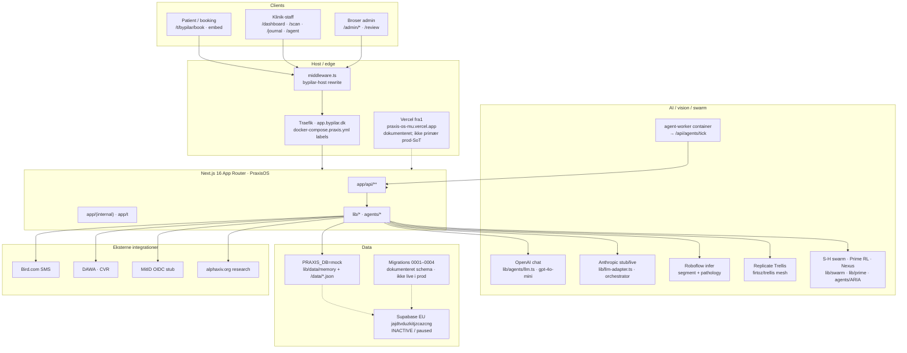

# PraxisOS · Arkitekt-briefing til ekstern AI-arkitekt

**Formål:** Copy-paste-klar teknisk + forretningsmæssig gennemgang af *nuværende* løsning, så en ekstern AI-arkitekt kan vurdere evolution mod en komplet online AI-fodplejeløsning (automatiseret viden, vejledning, triage, opfølgning, menneskelig eskalering).

**Repo:** `Broser-ai/PraxisOS` · branch-base `main` @ `b130d7d` (2026-09-03)  
**Produkt:** PraxisOS B2B clinic OS · by Pilar = pilot white-label på bypilar-hosts · Broser-only tenants/API/MCP/DB  
**Klinisk politik:** AI-fund = forslag (suggestion-only) · pathology i shadow indtil kliniker-gates  
**Produktion (verificeret live 2026-09-03):** `https://app.bypilar.dk` på Hetzner `167.233.171.184`

**Læsevejledning:** Skeln mellem **implementeret i kode**, **dokumenteret**, og **verificeret live**. Hvor noget ikke er fundet eller ikke kan bekræftes, står det eksplicit.

---

# 1. Executive summary

PraxisOS er et multi-tenant Next.js-klinik-OS (booking, journal, agenter, fod-scan, B2B-licens) med by Pilar som white-label pilot. På bypilar-hosts (`app.bypilar.dk` m.fl.) omskriver middleware forsiden til klinik-tenant `/t/bypilar` — ikke PraxisOS B2B-landing.

**Hvad der kører i produktion i dag (verificeret live):**

| Observation | Evidens |
|-------------|---------|
| App svarer 200 på `/scan`, `/t/bypilar`, `/api/health`, `/api/scan/config` | HTTP-probe 2026-09-03 |
| `dbMode: "mock"`, `backend: "memory"` | `GET /api/health` — `SUPABASE_SERVICE_ROLE_KEY missing` |
| Scan-providers klar: Replicate + Roboflow + OpenAI | `GET /api/scan/config` → `liveReady: true`, `llmReady: true` |
| Bird SMS konfigureret | `GET /api/bird/status` → `configured: true`, workspace + channel ready |
| Agent-worker kører (mange ticks) | `GET /api/agents/status` → `ticks: 33500+`, Bird OK |

**Hvad der *ikke* er et komplet AI Foot-Care Concierge endnu:**

- Ingen patient-facing AI-triage/guidning/opfølgnings-loop som produktflow (kun staff-scan + booking + portal-demo).
- Pathology/diagnostik er hard-locked til `suggestion_only` / shadow; Class IIa-agenter (Niels, Liv, Atlas) er `frozen` uden CE.
- Persistent DB i prod er **mock/memory** (+ filvolumen `/data` for journal/secrets) — ikke live Supabase.
- Cloud Supabase-projekt `jajdtvduzkitjzcazcng` er **INACTIVE** (paused) — verificeret via Supabase API 2026-09-03.
- Self-host Postgres/compose (`docker-compose.db.yml`) findes på research-branch `cursor/supabase-selfhost-migrate-2c11`, **ikke** på `main` i denne snapshot.
- LoRA / model-træning er bevidst *ikke* i træet (`docs/vision/lora-status.md`, `PRIME_INVARIANTS.NO_MODEL_TRAINING`).

**Forretningsposition:** B2B SaaS (Starter → Enterprise) med modulær licens; by Pilar trial unlimited. Målmarked: fodpleje/klinik-OS vs. EasyPractice-lignende huller (AI, AR/CV, felt). MDR Class IIa-track er bevidst på hold (Presafe) indtil pilot-signal — dokumenteret i `docs/ops/michaels-action-list.md` (arkiv/historisk, verificér før handling).

---

# 2. Systemarkitektur

## 2.1 Lag (som de findes i kodebasen + live host)

## 2.2 Frontend

| Flade | Sti | Rolle |
|-------|-----|--------|
| Klinik white-label | `/t/[tenant]/*` | Landing, book (5 trin), portal, gavekort/klippekort, setup |
| Embed | `/embed/v1/[tenant]` | Script til bypilar.dk booking-modal |
| Staff | `app/(internal)/*` | dashboard, kalender, klienter, bookings, scribe, agent, scan, journal, felt |
| Broser hub | `/review`, `/admin/*` | tenants, swarm, bird, agents/automation, packaging, health, research |
| Marketing (ikke på bypilar `/`) | `/`, `/pricing`, `/signup`, `/funktioner` | B2B-salg; på bypilar-host redirectes `/` → `/t/bypilar` |

**Host-separation:** `middleware.ts` — hosts `app.bypilar.dk`, `bypilar.dk`, `www.bypilar.dk`; blokerer `/shop` på disse hosts.

## 2.3 Backend / API (udvalg — konkrete routes)

**Auth:** `POST /api/auth/login`, `POST /api/auth/logout`  
**Bemærk:** `lib/staff-session.ts` kalder `GET /api/auth/me` — **route findes ikke** i `app/api/auth/` (kun login/logout). *Ikke fundet i kodebasen.*

**Klinik-data:**  
`/api/v1/[tenant]/services|availability|bookings|bookings/list|clients|lookup|voucher`  
`/api/journal/*`, `/api/signup`, `/api/tenant/setup`, `/api/license`

**Scan / Nexus:**  
`GET|POST /api/scan/config` · `GET|POST /api/v1/scan/process`

**Agenter / swarm / research:**  
`/api/agents/{status,run,tick,workflows,approvals}` · `/api/cron/swarm-tick`  
`/api/v1/[tenant]/{swarm,swarm/stream,swarm/tick,orchestrator,research,...}`  
`POST /api/mcp/v1` (JSON-RPC MCP-tools)

**Messaging:** `/api/bird/{config,send,status}` · `/api/events` (SSE)

**Health:** `GET /api/health`

## 2.4 Database

| Mode | Kode | Live prod 2026-09-03 |
|------|------|----------------------|
| `mock` (default) | `lib/supabase.ts`, `lib/data/repo.ts`, `lib/data/memory.ts` | **Aktiv** — health siger memory |
| `supabase-local` / `supabase-eu` | samme switcher + `@supabase/supabase-js` | **Ikke aktiv** (service role mangler) |
| Schema | `supabase/migrations/0001`–`0004` | Dokumenteret; **ikke verificeret applied** på live host |

**0001 kerne-tabeller (dokumenteret):** `tenants`, `users`, `memberships`, `services`, `clients`, `bookings`, `journals`/`journal_entries` (pgvector 1536), `scans`, `payments`, `vouchers`, `subsidy_schemes`, `reports`, `events`, `audit_log`, `api_keys`, `webhook_subscriptions`, `module_activations` (+ RLS).

**0003–0004:** `swarm_snapshots`, `swarm_memory`, agent ledger — til swarm-persist når Supabase er konfigureret.

**Durable filer på self-host (når `PRAXIS_DATA_DIR=/data`):** `secrets.json`, `journal-store.json`, `swarm-memory.json` (se `lib/secrets.ts`, `lib/journal.ts`, `agents/memory/swarm-memory.ts`).

## 2.5 Auth

- Demo-konti + scrypt-password + HMAC-signed session cookie (`lib/auth.ts`, `lib/session-token.ts`, `PRAXIS_SESSION_SECRET`).
- Tenant API: session-headers **eller** Bearer API-key (`lib/request-auth.ts`, `lib/api-keys.ts`).
- MitID: **UI-stub** (`app/login/mitid/page.tsx`) — ikke live OIDC-broker.
- Roller i schema/docs: `owner | practitioner | reception | support`.

## 2.6 Uploads / vision I/O

- Scan: kamera (`getUserMedia`) eller fil → base64/data-URL → `POST /api/v1/scan/process` (`components/NexusScanPanel.tsx`).
- Ingen separat object-storage-bucket i aktiv prod-path; billeder går til Roboflow/Replicate over HTTP ved inference.
- Privacy-gate (`lib/scanner/privacy-gate.ts`) fail-closed for **custom** shadow-uploads; Broser operational unlock dokumenteret 2026-08-27 (formel DPA-PDF stadig pending).

## 2.7 Hosting / CI/CD

| Lag | Status |
|-----|--------|
| **Primær prod** | Hetzner Docker Compose `docker-compose.praxis.yml` · Traefik `app.bypilar.dk` · port 3010 · `scripts/deploy-hetzner.sh` / cutover-scripts |
| **Vercel** | `vercel.json` region `fra1` · URL `praxis-os-mu.vercel.app` (200) — historisk/parallelt; env ofte mock |
| **CI** | `.github/workflows` **ikke fundet** i repo-rod på `main` |
| **Agent-worker** | Sidecar container → periodisk `POST /api/agents/tick` |

## 2.8 Integrationer (bekræftet vs. stub)

| Integration | Implementering | Live |
|-------------|----------------|------|
| Bird SMS | `lib/bird.ts` + admin UI | **Ja** (configured) |
| OpenAI | `lib/agents/llm.ts` | **Ja** (llmReady) |
| Roboflow | `lib/scanner/roboflow-infer.ts`, alpha-pipeline | **Ja** |
| Replicate Trellis | `lib/scanner/trellis-mesh.ts` | **Ja** (token present) |
| DAWA / CVR | API routes | Kode live; **ikke re-testet** eksternt i denne briefing |
| MitID / MedCom / NemSMS / FMK / Stripe acquiring | stubs / templates | **Ikke live** |
| alphaxiv | `lib/alphaxiv/*` + research API | Kode; live-afhængighed af ekstern API |
| Anthropic LangGraph orchestrator | `lib/llm-adapter.ts` + `lib/orchestrator.ts` | Stub uden `ANTHROPIC_API_KEY` |

---

# 3. AI-løsningen i dag

## 3.1 Modeller / providers (bekræftet)

| Provider | Brug | Default / pin |
|----------|------|----------------|
| **OpenAI** | Agent chat + tool-loop | `OPENAI_MODEL=gpt-4o-mini` · `OPENAI_BASE_URL` |
| **Anthropic** | LangGraph orchestrator-adapter | Kun hvis `ANTHROPIC_API_KEY` + `PRAXIS_LLM_MODE≠stub` |
| **Roboflow** | Segment + pathology candidates | `foot-segmentation-ehn9q/1`, `foot-ulcer/1`, `wounds-detection/1` |
| **Replicate** | 3D mesh | Concept pin `firtoz/trellis` · versioned predictions API |
| **Lokal “embedding”** | Swarm memory cosine | Hash-bag-of-chars i `agents/memory/swarm-memory.ts` — **ikke** OpenAI embeddings-RAG |

**LoRA:** *Ikke i kodebasen* — bevidst deferred (`docs/vision/lora-status.md`).

## 3.2 Call sites

1. **Del Pilar Nexus scan:** `POST /api/v1/scan/process` → `agents/ARIA-orchestrator.ts` → `AlphaSpatiotemporalPipeline` (`lib/scanner/alpha-pipeline.ts`) → Roboflow + Trellis + MonoMSK (`lib/physics/mono-msk-tensor.ts`) + quality gate.
2. **Clinic agents (9 personas):** `lib/agents/runtime.ts` → OpenAI tool-loop **eller** heuristic fallback → MCP tools (`lib/mcp-handlers.ts`).
3. **Agent worker / workflows:** `scripts/agent-worker.mjs` → `/api/agents/tick` → Nexus harvest + automation jobs.
4. **Swarm / Prime:** `/api/v1/[tenant]/swarm*` · `lib/swarm/*` · `lib/prime/*` · MCP `prime_rlvr_quiz`, `prime_status`.
5. **Research:** LUNA + alphaxiv (`lib/alphaxiv`, `/api/v1/[tenant]/research*`).
6. **Shadow eval (parallel):** `lib/scanner/shadow-inference.ts` — må ikke påvirke patient-copy / quality / routing.

## 3.3 Agenter / swarm / prime / worktree

| Lag | Path | Rolle |
|-----|------|--------|
| Clinic personas | `lib/agents.ts` | Aria, Niels, Sigrid, … — MDR tier + deployment status |
| Prompts / tool allow-list | `lib/agents/prompts.ts` | Dansk; eskalér; ingen opdigtede CPR/diagnoser |
| ARIA Nexus orchestrator | `agents/ARIA-orchestrator.ts` | scan / harvest / code / render / recall |
| Specialists | `agents/specialists/*` | DR-NINA, FELIX, LUNA, PRIME-rl |
| S-H swarm | `lib/swarm/s-agents.ts`, `daemon.ts`, `meta-harness.ts` | Autonom ticks, human approve |
| Worktree | `lib/swarm/worktree-manager.ts`, `lib/worktree/manager.ts` | Draft branches `cursor/swarm-*-2c11` |
| Prime RL | `lib/prime/*` | RLVR quiz class_0 education — **ingen** model training |
| Human gate | `scripts/harness-human-gate.mjs` | Rank spike → stop; **NO_AUTO_MERGE** |

**Hard invariants (kode):**

- `SWARM_INVARIANTS.NO_AUTO_MERGE` / `NO_AUTO_DEPLOY` = true  
- `CLINICAL_POLICY.clinical_status = "suggestion_only"`  
- `PRIME_INVARIANTS.NO_MODEL_TRAINING` / `PATHOLOGY_SHADOW_UNTIL_GATES` / `AI_SUGGESTIONS_ONLY`

## 3.4 RAG / knowledge

| Påstand | Realitet |
|---------|----------|
| pgvector på `journal_entries` | **Schema/dokumenteret** i migration 0001 — **ikke** aktiv i prod mock |
| Klinisk RAG over lærebøger | **EPIC-4 harness-docs / vision** — AdaptiveTutor “ikke startet” |
| Swarm memory | Fil + lokal embedding; optional Supabase upsert når konfigureret |
| alphaxiv harvest | Research-papers til memory — **ikke** patient-triage knowledge base |

## 3.5 Guardrails / prompts

- Base rules i `lib/agents/prompts.ts`: dansk, ingen opdigtede diagnoser/CPR, eskalér ved usikkerhed, markér godkendelser.
- Adjudication-schema: `lib/scanner/adjudication.ts` (draft only — ingen persist-UI endnu).
- Quality PASS/HOLD: `lib/scanner/quality.ts` + `SCAN_QUALITY_THRESHOLD` (default 70).
- Agent dispatch gate: `canDispatchAgent` — Class IIa kræver `ce_marked` (bypilar clinical-dev kun non-production).

## 3.6 Persistens af AI-output

- Scan → valgfri journal SOAP-opdatering (`/api/v1/scan/process` + `lib/journal.ts`) med eksplicit “AI er beslutningsstøtte”.
- Agent runs: `lib/agent-store.ts` (in-memory/fil — se agent-store).
- Swarm snapshots / memory: fil eller Supabase-tabeller når DB live.
- Audit: `lib/audit.ts` + dokumenteret hash-chain i Postgres (kun når DB live).

---

# 4. Brugerrejse

Otte trin i **nuværende** produkt (staff + patient). Hvert trin: hvad brugeren ser / systemet gør / data / hvor flowet stopper ift. AI-concierge.

### Trin 1 — Patient finder klinik / booker
- **Ser:** `/t/bypilar` eller embed-knap på bypilar.dk; 5-trins book (`/t/bypilar/book`).
- **System:** `GET services/availability` · `POST bookings` · valgfri subsidy/voucher/MitID-modal (MitID = stub).
- **Data:** Booking + klient i **memory-store** (prod mock); events via event-bus.
- **Stopper:** Ingen AI-anamnese/triage før booking; bekræftelse er class_0 Aria-agtig, ikke medicinsk vejledning.

### Trin 2 — Staff logger ind
- **Ser:** `/login` · demo `pilar@bypilar.dk` / `demo` (dokumenteret i README).
- **System:** `POST /api/auth/login` → HMAC session-cookie.
- **Data:** Session cookie; konti i `lib/auth.ts` (eller Supabase hvis konfigureret).
- **Stopper:** `/api/auth/me` mangler → nogle admin-sider kan ikke resolve session via `fetchStaffSession`.

### Trin 3 — Dagens drift
- **Ser:** `/dashboard`, `/kalender`, `/klienter`, `/bookings`.
- **System:** Læser mock/seed-data + evt. nye bookings.
- **Data:** `lib/bookings.ts`, `lib/clients.ts`, memory repo.
- **Stopper:** Ingen automatisk “patient har brug for opfølgning”-agent til patienten.

### Trin 4 — Klinisk fod-scan (kerne-AI i dag)
- **Ser:** `/scan` · NexusScanPanel (kamera/upload, 3D-viewer, quality PASS/HOLD, findings).
- **System:** `POST /api/v1/scan/process` → ARIA → Alpha pipeline (segment, pathology candidates, Trellis mesh, MonoMSK) → quality score.
- **Data:** Scan-resultat i response; valgfri journal-linje hvis `bookingId`; shadow audit hvis flags.
- **Stopper:** Findings er kandidater; HOLD hvis quality fejler; **ingen** patient-app der forklarer resultatet autonomt.

### Trin 5 — Journal / SOAP
- **Ser:** `/journal`, `/journal/[id]` · draft/rediger/signér.
- **System:** `PATCH /api/journal/[id]`, `POST .../sign` · Niels er Class IIa **frozen** for autonom klinisk claim.
- **Data:** `journal-store.json` under `/data` (self-host) eller memory.
- **Stopper:** Signering er menneskelig; AI må ikke auto-signere (`NO_AUTO_JOURNAL_SIGN`).

### Trin 6 — Staff-agent / automation
- **Ser:** `/agent`, `/admin/agents/automation`, `/admin/swarm`.
- **System:** OpenAI tool-loop eller heuristics; worker ticks workflows (booking confirm, reminders); Bird SMS.
- **Data:** Agent runs, approvals (live: mange `pendingApprovals`), Bird send-log via API.
- **Stopper:** Workflows er klinik-ops (bekræftelse/påmindelse) — **ikke** klinisk triage-concierge; human approve på swarm merge.

### Trin 7 — Patientportal
- **Ser:** `/t/bypilar/portal` (demo-login som Mette).
- **System:** Viser subsidy/profil-demo fra `lib/subsidies`.
- **Data:** Seed-profiler — ikke fuld journal/scan-deling.
- **Stopper:** Ingen chat, ingen guidance, ingen foto-upload fra patient til AI-triage.

### Trin 8 — Opfølgning / eskalering
- **Ser:** Staff kan SMS via Bird admin; journal P-felt foreslår “aftales med behandler”.
- **System:** Bird send API; ingen automatiseret clinical follow-up state machine.
- **Data:** SMS via Bird; ingen dedicated `follow_ups`-tabel i aktiv mock-path.
- **Stopper:** **Her mangler hele AI Foot-Care Concierge-loopet** (viden → vejledning → triage → follow-up → human escalate).

---

# 5. Fodpleje-faglighed og klinisk sikkerhed

Skala: **A** = findes (implementeret + relevant) · **B** = delvist · **C** = mangler.

| Område | Score | Evidens |
|--------|-------|---------|
| Suggestion-only / ingen auto-diagnose | **A** | `lib/swarm/clinical-policy.ts`, adjudication, prompts, journal-copy |
| Pathology shadow + privacy/canary gates | **A/B** | Kode + docs; live canary/shadow **dokumenteret** på host (cutover/privacy-unlock) — env på host **ikke re-læst via SSH** i denne run (`Ikke verificeret live` for hver flag-værdi) |
| Quality gate PASS/HOLD | **A** | `lib/scanner/quality.ts`, acceptance-criteria |
| 3D mesh + biomekaniske proxies | **A/B** | Trellis + MonoMSK implementeret; proxies ≠ force-plate GT (eksplicit i docs) |
| Kliniker-adjudication UI/persistens | **B/C** | Schema/helpers i kode; **ingen** fuld clinic UI/DB-flow fundet |
| MDR Class IIa freeze / CE-gate | **A** | `canDispatchAgent`, AGENT_MDR_TIER; Presafe on hold (docs) |
| ISO 14971 / QMS | **B** | Arkiv under `docs/ops/qms/` — “archive only”, ikke live QMS-SoT |
| Patient-facing klinisk vejledning | **C** | Explicit `used_for_patient_response: false` |
| Automatiseret triage (rød/gul/grøn → escalate) | **C** | Ikke fundet som produktflow |
| Continuity / follow-up care plans | **C** | Kun manuelle journal-P + SMS stubs |
| Fodpleje knowledge base (RAG) | **C** | Vision/EPIC; ikke implementeret patient-RAG |
| Orthotic CAD pipeline | **B/C** | OpenSCAD sketch i `modules/foot-scanner/`; Python-engine **ikke** i træet (kun README + docs-arkitektur) |
| Formel DPA med vision-processorer | **B** | Operational accept dokumenteret; PDF pending |
| Plantar E2E Broser-checklist | **B** | Docs findes; **ikke lukket** ifølge cutover-residual |

---

# 6. Gap-analyse til AI Foot-Care Concierge

Målprodukt (ønsket): automatiseret viden, vejledning, triage, opfølgning, human escalation — online.

| Prio | Gap | Nuværende | Behov for concierge | Afhængigheder / risiko |
|------|-----|-----------|---------------------|------------------------|
| P0 | Persistent, tenant-isoleret DB | mock/memory; Supabase paused | Postgres (+ RLS) i EU på Broser-host | Self-host migrate-branch ikke på main; data-migration |
| P0 | Klinisk safety envelope for *patient*-AI | Staff-only suggestions | Policy + audit for patient-facing copy; CE/MDR vurdering | Class IIa / claim-scope |
| P0 | Durable identity & session for patient + staff | Demo auth; `/api/auth/me` mangler | MitID eller stærk patient-auth; staff me-endpoint | Trust-aftale MitID |
| P1 | Triage state machine | Scan findings som kandidater | Symptom+foto → risk bands → escalate/book | Adjudicated models; human gate |
| P1 | Knowledge / guidance layer | alphaxiv research + local memory | Curated fodpleje-KB + citations; ingen “opdigtet råd” | Content governance; RAG eval |
| P1 | Follow-up orchestration | Bird reminders class_0 | Care-plan tasks, adherence, escalate-to-clinician | Journal linkage; SMS/consent |
| P1 | Patient UX surface | Portal demo | Chat/guidet flow + upload + status | Brand (by Pilar) + PraxisOS white-label |
| P2 | Pathology promotion | Shadow + canary ≤5% | Adjudication N≥50 + precision floors | Broser + clinician approvers |
| P2 | Orthotic / physical fulfillment | OpenSCAD sketch | Mill LOI / DeviceRequest (historisk action list) | Partneraftale |
| P2 | Observability / CI | Ingen GitHub Actions fundet | Tests+deploy gates på main | Host SSH hygiene |
| P2 | LoRA / personalisering | Forbidden | Evt. senere ekstern trainer — **ikke** nu | Explicit Broser unlock |

---

# 7. Roadmap Fase 1 / 2 / 3

### Fase 1 — Stabil klinik-kerne + sikker AI-assist (staff)
- Flyt prod fra mock → self-host Postgres (eller genåbn Supabase) med migrations 0001–0004.
- Luk auth-huller (`/api/auth/me`, session på admin).
- Fasthold suggestion-only; adjudikation-UI for shadow findings.
- Bird + OpenAI workflows til booking/påmindelse (allerede delvist live).
- Luk Broser plantar E2E-checklist; dokumentér DPA-PDF residual.

### Fase 2 — Online vejledning + triage (patient, gated)
- Patientflade: guidet Q&A + foto-upload → **non-diagnostic** guidance + book/escalate.
- Care-plan / follow-up objekter i DB; Bird/WhatsApp templates med consent.
- Curated knowledge base (Broser-godkendt) + retrieval med citations; ingen fri “diagnose-LLM”.
- Human escalation queue i staff UI (Frej/Aria class_0 + kliniker).

### Fase 3 — Completeness under regulatorisk spor
- Pathology promotion pack når acceptance §C opfyldt.
- Eventuel CE/MDR for Class IIa claims (Niels/Liv/scan-claims) — Presafe genoptages kun på Michael-signal.
- Orthotic/mill-integration hvis LOI.
- LoRA kun efter eksplicit Broser-beslutning + uden for diagnose-path.

---

# 8. Teknisk handlingsplan (10 tasks)

| # | Prio | Task | Primære filer / routes |
|---|------|------|------------------------|
| 1 | **P0** | Aktivér durable DB på Hetzner (Postgres + apply migrations); sæt `PRAXIS_DB` væk fra mock | `lib/supabase.ts`, `lib/data/repo.ts`, `supabase/migrations/*`, `.env.production` |
| 2 | **P0** | Implementér `GET /api/auth/me` + verifikation af staff-session på admin | `lib/staff-session.ts`, ny `app/api/auth/me/route.ts` |
| 3 | **P0** | Formaliser patient-facing AI policy (hvad må/ikke må siges) + audit events | `lib/swarm/clinical-policy.ts`, `lib/agents/prompts.ts`, QMS |
| 4 | **P1** | Adjudication persist + staff UI (agree/disagree/unsure) | `lib/scanner/adjudication.ts`, `/journal` eller `/scan` |
| 5 | **P1** | Triage API: intake → risk band → escalate/book (suggestion envelope) | ny route under `/api/v1/[tenant]/…`, journal link |
| 6 | **P1** | Patient guidance UI (by Pilar-brandet) med human handoff | `app/t/[tenant]/…`, Bird templates |
| 7 | **P1** | Knowledge pack: Broser-curated docs → retrieval (start uden LoRA) | ny `lib/knowledge/*`; undgå ukontrolleret web-RAG |
| 8 | **P2** | CI: typecheck + vitest på PR; deploy smoke `/api/health` + `/api/scan/config` | `.github/workflows` (mangler i dag) |
| 9 | **P2** | Shadow→promotion runbook execution (N, precision, model card) | `docs/vision/acceptance-criteria.md`, `promotion/*` |
| 10 | **P2** | Host cutover hygiene: bekræft git SHA på Hetzner = `main`; secrets volume backup | `docs/ops/production-cutover-2026-09-01.md`, `scripts/production-cutover-main.sh` |

---

# 9. Åbne spørgsmål

1. Skal AI Foot-Care Concierge være **by Pilar-brandet** (white-label) eller **PraxisOS**-brandet multi-tenant fra dag 1?
2. Hvilket **juridisk claim-scope** ønskes i Fase 2: kun “information/booking”, eller klinisk beslutningsstøtte (MDR)?
3. Er **self-host Postgres på Hetzner** den endelige SoT, eller skal paused Supabase `jajdtvduzkitjzcazcng` restores?
4. Må patient-fotos sendes til Roboflow/Replicate under nuværende **operational DPA-accept**, eller kræves formel PDF før patient-self-scan?
5. Hvem er **navngiven kliniker** til adjudication, og hvad er N/precision-mål for promotion?
6. Skal **Liv** (patient-coach, Class IIa frozen) låses op under CE, eller bygges en ny class_0 “guidance”-agent?
7. Hvilken kanal er primær til follow-up: **Bird SMS**, email, WhatsApp, in-app?
8. Er Python foot-scanner-engine fra Drive-arkitektur **in-scope**, eller forbliver TypeScript Nexus den eneste scan-path?
9. Hvad er go/no-go for **LoRA** (ekstern Tinker m.m.) vs. forever-forbidden i clinic path?
10. Skal Vercel-deployment beholdes som failover, eller er Hetzner `app.bypilar.dk` eneste prod?

---

## Appendix A · Verifikation udført i denne briefing (2026-09-03)

| Check | Resultat |
|-------|----------|
| `GET https://app.bypilar.dk/api/health` | `dbMode: mock`, memory backend |
| `GET https://app.bypilar.dk/api/scan/config` | `liveReady: true`, `llmReady: true`, blockers `[]` |
| `GET https://app.bypilar.dk/api/bird/status` | configured, workspace+channel ready |
| `GET https://app.bypilar.dk/api/agents/status` | worker aktiv; 9 personas listet; automation ticks høje |
| Supabase project `jajdtvduzkitjzcazcng` | status **INACTIVE** (paused) |
| SSH til Hetzner / læsning af host `.env.production` | **Ikke udført** i denne agent-run (nøgle/console ikke brugt) |
| `docker-compose.db.yml` på `main` | **Ikke fundet** (findes på selfhost-migrate-branch) |
| ManagePullRequest MCP-tool | **Ikke tilgængelig** i denne session |

## Appendix B · Nøgledokumenter

- `HANDOVER.md`, `PRAXISOS-BRIEF.md`, `CODE-MAP.md`, `README.md`, `PRODUCTION.md`, `START-SELVHOST.md`
- `docs/ops/agent-stack-setup.md`, `production-cutover-2026-09-01.md`, `openai-llm-setup.md`
- `docs/vision/*` (privacy, shadow, acceptance, lora-status, harness-human-gate, foot-scanner-architecture)
- `docs/harness/EPIC-*.md`, `docs/swarm-worktree-runtime.md`
- `.env.example`, `.env.production.example`

---

*Udarbejdet til Michael Ambrosius (Broser) · ekstern AI-arkitekt-review · kun dokumentation; ingen produktadfærdsændring.*
