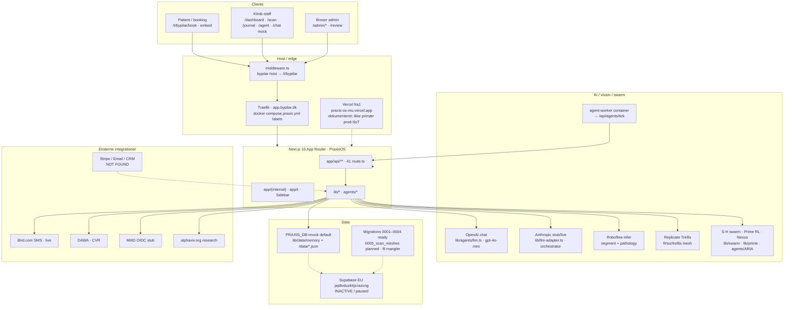

# PraxisOS · Arkitekt-briefing til ekstern AI-arkitekt

**Formål:** Copy-paste-klar teknisk + forretningsmæssig gennemgang af *nuværende* løsning, så en ekstern AI-arkitekt kan vurdere evolution mod en komplet online AI-fodplejeløsning (automatiseret viden, vejledning, triage, opfølgning, menneskelig eskalering).

**Repo:** `Broser-ai/PraxisOS` · branch `cursor/ai-fodpleje-arkitekt-briefing-2c11` · base `main` @ `b130d7d` (2026-09-03)  
**Produkt:** PraxisOS B2B clinic OS · by Pilar = pilot white-label på bypilar-hosts · Broser-only tenants/API/MCP/DB  
**Klinisk politik:** AI-fund = forslag (`suggestion_only`) · pathology i shadow indtil kliniker-gates  
**Produktion (verificeret live 2026-09-03):** `https://app.bypilar.dk` på Hetzner `167.233.171.184`

**Læsevejledning:** Skeln mellem **implementeret i kode**, **dokumenteret**, og **verificeret live**. Hvor noget ikke er fundet eller ikke kan bekræftes, står det eksplicit som **NOT FOUND** eller **ikke verificeret**.

---

# 1. Executive summary

PraxisOS er et multi-tenant Next.js 16 klinik-OS (booking, journal, agenter, fod-scan, B2B-licens) med by Pilar som white-label pilot. På bypilar-hosts (`app.bypilar.dk` m.fl.) omskriver `middleware.ts` forsiden til klinik-tenant `/t/bypilar` — ikke PraxisOS B2B-landing.

**Hvad der kører i produktion i dag (verificeret live 2026-09-03):**

| Observation | Evidens |
|-------------|---------|
| App svarer 200 på `/scan`, `/t/bypilar`, `/api/health`, `/api/scan/config` | HTTP-probe |
| `dbMode: "mock"`, `backend: "memory"` | `GET /api/health` — `SUPABASE_SERVICE_ROLE_KEY missing` |
| Scan-providers klar: Replicate + Roboflow + OpenAI | `GET /api/scan/config` → `liveReady: true`, `llmReady: true` |
| Bird SMS konfigureret | `GET /api/bird/status` → `configured: true`, workspace + channel ready |
| Agent-worker kører (mange ticks) | `GET /api/agents/status` → `ticks: 33500+`, Bird OK, `llmConfigured: false` på automation men `llm.configured: true` |

**Hvad der *ikke* er et komplet AI Foot-Care Concierge endnu:**

- **Patient-facing AI-chat:** NOT FOUND (ingen patient-chat-route).
- **Follow-up-produktflow:** NOT FOUND (ingen dedicated follow-up-route/tabel i aktiv path).
- **Human handoff UI (kliniker-kø):** NOT FOUND som produktflade (kun prompts/approvals/admin-mock-logs).
- Pathology/diagnostik hard-locked til `suggestion_only` / shadow; Class IIa-agenter (Niels, Liv, Atlas) er `frozen` uden CE.
- Persistent DB i prod er **mock/memory** (+ filvolumen `/data` for journal/secrets) — ikke live Supabase.
- Cloud Supabase-projekt `jajdtvduzkitjzcazcng` er **INACTIVE** (paused) — verificeret via Supabase API 2026-09-03.
- `docker-compose.db.yml` **NOT FOUND** på `main` / denne branch (findes på research-branch `cursor/supabase-selfhost-migrate-2c11` — **ikke** i dette træ).
- LoRA / model-træning er bevidst *ikke* i træet (`docs/vision/lora-status.md`, `PRIME_INVARIANTS.NO_MODEL_TRAINING`).
- Stripe SDK/pakke **NOT FOUND** i `package.json` / kode — `PaymentStep` er UI-simuleret (`setTimeout` → `onPaid`).
- Email-provider **NOT FOUND**. CRM **NOT FOUND**. Clerk **NOT FOUND**.

**Forretningsposition:** B2B SaaS (Starter → Enterprise) med modulær licens; by Pilar trial unlimited. Målmarked: fodpleje/klinik-OS vs. EasyPractice-lignende huller (AI, AR/CV, felt). MDR Class IIa-track er bevidst på hold (Presafe) indtil pilot-signal — dokumenteret i `docs/ops/michaels-action-list.md` (arkiv/historisk, verificér før handling).

---

# 2. Systemarkitektur

## 2.1 Lag (som de findes i kodebasen + live host)

## 2.2 Frontend

| Flade | Sti | Rolle | Status |
|-------|-----|--------|--------|
| Klinik white-label | `/t/[tenant]/*` | Landing, book (5 trin), onboarding, portal, gavekort/klippekort, setup | Implementeret |
| Embed | `/embed/v1/[tenant]` | Script til bypilar.dk booking-modal | Implementeret |
| Staff (Sidebar) | `app/(internal)/*` | dashboard, kalender, klienter, bookings, scribe, agent, chat, scan, journal, felt | Implementeret |
| Broser hub | `/review`, `/admin/*` | tenants, swarm, bird, agents/automation, packaging, health, research | Implementeret |
| Marketing | `/`, `/pricing`, `/signup`, `/funktioner` | B2B-salg; på bypilar-host redirectes `/` → `/t/bypilar` | Implementeret |
| Login stubs | `/login`, `/login/mitid`, `/login/passkey` | MitID + passkey er **UI-stubs** | Stub |
| Staff chat | `/chat` | **Simuleret** client-side `composeReply` — ingen LLM-API | Mock |
| Staff agent | `/agent` | Live `POST /api/agents/run` | Live API |
| Scan | `/scan` | `NexusScanPanel` (kamera/upload → base64) | Live path |
| Patient chat | — | — | **NOT FOUND** |
| Follow-up route | — | — | **NOT FOUND** |
| Human handoff UI | — | Kliniker-eskaleringskø som produkt | **NOT FOUND** |

**Host-separation:** `middleware.ts` — hosts `app.bypilar.dk`, `bypilar.dk`, `www.bypilar.dk`; blokerer `/shop` på disse hosts; redirect `/` → `/t/bypilar`.

**Orphan-komponenter (findes, men ikke importeret i pages):**

- `components/FootScan.tsx` — **orphan** (ingen `import`/`<FootScan>` i app; aktiv scan bruger `NexusScanPanel`).
- `components/SwarmPanel.tsx` — **orphan** (ingen `import`/`<SwarmPanel>`; admin bruger `/admin/swarm`).

## 2.3 Backend / API

**Tæl:** **41** filer `app/api/**/route.ts` (verificeret i træet).

**Auth:**

- Cookie `praxis_session` (HMAC-signeret) + scrypt-passwords — `lib/session-token.ts`, `lib/auth.ts`.
- `POST /api/auth/login`, `POST /api/auth/logout`.
- `lib/staff-session.ts` kalder `GET /api/auth/me` — **route findes ikke** i `app/api/auth/` (kun login/logout). **NOT FOUND.**
- MitID: UI-stub (`app/login/mitid/page.tsx`) — ikke live OIDC-broker.
- Clerk: **NOT FOUND** i `package.json` / kode.
- Roller defineret: `owner | practitioner | reception | support` (`lib/auth.ts` + migration CHECK). **Svagt håndhævet:** `authorizeTenantRequest` (`lib/request-auth.ts`) bruges **kun i tests** — **0** `route.ts` kalder den (verificeret grep). Journal, scan/process, agents/run, bookings har **ingen** session-guard i route-filerne.

**Klinik-data:**  
`/api/v1/[tenant]/services|availability|bookings|bookings/list|clients|lookup|voucher`  
`/api/journal/*`, `/api/signup`, `/api/tenant/setup`, `/api/license`

**Scan / Nexus:**  
`GET|POST /api/scan/config` · `POST /api/v1/scan/process` (JSON body med `imageBase64` / `imageUrl` — **ikke** multipart).

**Agenter / swarm / research:**  
`/api/agents/{status,run,tick,workflows,approvals}` · `/api/cron/swarm-tick`  
`/api/v1/[tenant]/{swarm,swarm/stream,swarm/tick,orchestrator,research,...}`  
`POST /api/mcp/v1` (JSON-RPC MCP-tools)

**Messaging:** `/api/bird/{config,send,status}` · `/api/events` (SSE)

**Health:** `GET /api/health`

## 2.4 Database

| Mode | Kode | Live prod 2026-09-03 |
|------|------|----------------------|
| `mock` (**default** hvis `PRAXIS_DB` unset) | `lib/supabase.ts` L13: `?? "mock"` | **Aktiv** — health siger memory |
| `supabase-local` / `supabase-eu` | samme switcher + `@supabase/supabase-js` | **Ikke aktiv** (service role mangler) |
| Schema filer | `supabase/migrations/0001`–`0004` | Fil-klare; **ikke verificeret applied** på live host |
| `0005_scan_meshes` | Listet i `lib/supabase.ts` MIGRATIONS som `status: "planned"` | **Fil mangler** i `supabase/migrations/` |

**0001 kerne-tabeller (dokumenteret):** `tenants`, `users`, `memberships`, `services`, `clients`, `bookings`, `journals`/`journal_entries` (pgvector 1536), `scans`, `payments`, `vouchers`, `subsidy_schemes`, `reports`, `events`, `audit_log`, `api_keys`, `webhook_subscriptions`, `module_activations` (+ RLS).

**0003–0004:** `swarm_snapshots`, `swarm_memory`, agent ledger — til swarm-persist når Supabase er konfigureret.

**Durable filer på self-host (når `PRAXIS_DATA_DIR=/data`):** `secrets.json`, `journal-store.json`, `swarm-memory.json` (se `lib/secrets.ts`, `lib/journal.ts`, `agents/memory/swarm-memory.ts`).

**Bemærk:** Docs der nævner `docker-compose.db.yml` som del af dette træ er **forkerte for main/denne branch** — filen er **NOT FOUND** her.

## 2.5 Auth (detalje)

- Demo-konti + scrypt-password + HMAC-signed session cookie (`PRAXIS_SESSION_SECRET`).
- Tenant API-helper findes (`lib/request-auth.ts`, `lib/api-keys.ts`) men er **ikke wired** til routes.
- Role permission-map i `lib/auth.ts` (owner/practitioner/reception/support) — UI/admin kan vise permissions; API-routes håndhæver dem generelt **ikke**.

## 2.6 Uploads / vision I/O

- Scan: kamera (`getUserMedia`) eller fil → base64/data-URL → `POST /api/v1/scan/process` (`components/NexusScanPanel.tsx`).
- Ingen separat object-storage-bucket i aktiv prod-path; billeder går til Roboflow/Replicate over HTTP ved inference.
- Privacy-gate (`lib/scanner/privacy-gate.ts`) fail-closed for **custom** shadow-uploads; Broser operational unlock dokumenteret 2026-08-27 (formel DPA-PDF stadig pending).

## 2.7 Hosting / CI/CD

| Lag | Status |
|-----|--------|
| **Primær prod** | Hetzner Docker Compose `docker-compose.praxis.yml` · Traefik `app.bypilar.dk` · port 3010 · `scripts/deploy-hetzner.sh` / cutover-scripts |
| **Vercel** | `vercel.json` region `fra1` · URL `praxis-os-mu.vercel.app` — historisk/parallelt; env ofte mock |
| **CI** | `.github/` **NOT FOUND** i repo-rod |
| **Agent-worker** | Sidecar container → periodisk `POST /api/agents/tick` |

## 2.8 Integrationer (bekræftet vs. stub vs. NOT FOUND)

| Integration | Implementering | Live / status |
|-------------|----------------|---------------|
| Bird SMS | `lib/bird.ts` + admin UI + `/api/bird/*` | **Ja** (configured) |
| OpenAI | `lib/agents/llm.ts` + runtime + journal SOAP | **Ja** (llmReady) |
| Roboflow | `lib/scanner/roboflow-infer.ts`, alpha-pipeline | **Ja** |
| Replicate Trellis | `lib/scanner/trellis-mesh.ts` | **Ja** (token present) |
| Anthropic LangGraph | `lib/llm-adapter.ts` + `lib/orchestrator.ts` | Kode; stub uden `ANTHROPIC_API_KEY` |
| DAWA / CVR | API routes | Kode live; **ikke re-testet** eksternt i denne briefing |
| MitID / MedCom / NemSMS / FMK | stubs / templates | **Ikke live** |
| alphaxiv | `lib/alphaxiv/*` + research API | Kode; afhænger af ekstern API |
| Stripe | — | **NOT FOUND** i package/kode; `PaymentStep` simulerer betaling |
| Email-provider | — | **NOT FOUND** |
| CRM | — | **NOT FOUND** |
| Clerk | — | **NOT FOUND** |

---

# 3. AI-løsningen i dag

## 3.1 Modeller / providers (bekræftet)

| Provider | Brug | Default / pin |
|----------|------|----------------|
| **OpenAI** | Agent chat + tool-loop + journal SOAP-draft | `OPENAI_MODEL=gpt-4o-mini` · `OPENAI_BASE_URL` · `lib/agents/llm.ts` + runtime |
| **Anthropic** | LangGraph orchestrator-adapter | Kun hvis `ANTHROPIC_API_KEY` + `PRAXIS_LLM_MODE≠stub` · `lib/llm-adapter.ts` |
| **Roboflow** | Segment + pathology candidates | `foot-segmentation-ehn9q/1`, `foot-ulcer/1`, `wounds-detection/1` |
| **Replicate** | 3D mesh | Concept pin `firtoz/trellis` · versioned predictions API |
| **Lokal “embedding”** | Swarm memory cosine | `localEmbed` = hash bag-of-chars i `agents/memory/swarm-memory.ts` — **ikke** OpenAI embeddings-RAG |

**LoRA / træning:** *Ikke i kodebasen* — bevidst forbidden (`PRIME_INVARIANTS.NO_MODEL_TRAINING`, `docs/vision/lora-status.md`).

**Produkt-RAG (klinisk videnbase til patient):** **NOT FOUND.**

## 3.2 Call sites

1. **Del Pilar Nexus scan:** `POST /api/v1/scan/process` → `agents/ARIA-orchestrator.ts` → `AlphaSpatiotemporalPipeline` (`lib/scanner/alpha-pipeline.ts`) → Roboflow + Trellis + MonoMSK (`lib/physics/mono-msk-tensor.ts`) + quality gate.
2. **Clinic agents (9 personas):** `lib/agents/runtime.ts` → OpenAI tool-loop **eller** heuristic fallback → MCP tools (`lib/mcp-handlers.ts`). UI: `/agent` kalder live API; `/chat` er **simuleret**.
3. **Agent worker / workflows:** `scripts/agent-worker.mjs` → `/api/agents/tick` → Nexus harvest + automation jobs.
4. **Swarm / Prime:** `/api/v1/[tenant]/swarm*` · `lib/swarm/*` (S-H) · `lib/prime/*` · MCP `prime_rlvr_quiz`, `prime_status`. Prime = RLVR quiz/education — **ingen** model training.
5. **Worktree:** `lib/swarm/worktree-manager.ts` — human-gated; `NO_AUTO_MERGE`.
6. **Autonom awaken:** `scripts/awaken.ts` + swarm daemon ticks — locked invariants.
7. **MCP:** `POST /api/mcp/v1`.
8. **Research:** LUNA + alphaxiv (`lib/alphaxiv`, `/api/v1/[tenant]/research*`).
9. **Shadow eval (parallel):** `lib/scanner/shadow-inference.ts` — må ikke påvirke patient-copy / quality / routing.

## 3.3 Agenter / swarm / prime / worktree

| Lag | Path | Rolle |
|-----|------|--------|
| Clinic personas | `lib/agents.ts` | Aria, Niels, Sigrid, … — MDR tier + deployment status |
| Prompts / tool allow-list | `lib/agents/prompts.ts` | Dansk; eskalér; ingen opdigtede CPR/diagnoser |
| ARIA Nexus orchestrator | `agents/ARIA-orchestrator.ts` | scan / harvest / code / render / recall |
| Specialists | `agents/specialists/*` | DR-NINA, FELIX, LUNA, PRIME-rl |
| S-H swarm | `lib/swarm/s-agents.ts`, `daemon.ts`, `meta-harness.ts` | Autonom ticks, human approve |
| Worktree | `lib/swarm/worktree-manager.ts`, `lib/worktree/manager.ts` | Draft branches `cursor/swarm-*-2c11` |
| Prime RL | `lib/prime/*` | RLVR quiz class_0 education — **ingen** model training |
| Human gate | `scripts/harness-human-gate.mjs` | Rank spike → stop; **NO_AUTO_MERGE** |

**Hard invariants (kode):**

- `SWARM_INVARIANTS.NO_AUTO_MERGE` / `NO_AUTO_DEPLOY` = true  
- `CLINICAL_POLICY.clinical_status = "suggestion_only"`  
- `PRIME_INVARIANTS.NO_MODEL_TRAINING` / `PATHOLOGY_SHADOW_UNTIL_GATES` / `AI_SUGGESTIONS_ONLY`

## 3.4 RAG / knowledge

| Påstand | Realitet |
|---------|----------|
| pgvector på `journal_entries` | **Schema/dokumenteret** i migration 0001 — **ikke** aktiv i prod mock |
| Klinisk RAG over lærebøger / patient-guidance KB | **NOT FOUND** som produkt — EPIC-4 / vision “ikke startet” |
| Swarm memory | Fil + `localEmbed` bag-of-chars; optional Supabase upsert når konfigureret |
| alphaxiv harvest | Research-papers til memory — **ikke** patient-triage knowledge base |

## 3.5 Guardrails / prompts / eskalering

- Base rules i `lib/agents/prompts.ts`: dansk, ingen opdigtede diagnoser/CPR, eskalér ved usikkerhed, markér godkendelser.
- Adjudication-schema: `lib/scanner/adjudication.ts` (**placeholder** — ingen persist-UI endnu).
- Quality PASS/HOLD: `lib/scanner/quality.ts` + `SCAN_QUALITY_THRESHOLD` (default 70).
- Agent dispatch gate: `canDispatchAgent` — Class IIa kræver `ce_marked` (bypilar clinical-dev kun non-production).
- **Eskalering i dag** = prompt-tekst + swarm/agent **approvals** + admin mock-logs — **ikke** en clinician-facing handoff-produktkø. Human handoff UI: **NOT FOUND**.

## 3.6 Persistens af AI-output

- Scan → valgfri journal SOAP-opdatering (`/api/v1/scan/process` + `lib/journal.ts`) med eksplicit “AI er beslutningsstøtte”.
- Agent runs: `lib/agent-store.ts` (in-memory/fil).
- Swarm snapshots / memory: fil eller Supabase-tabeller når DB live.
- Audit: `lib/audit.ts` — default `PRAXIS_AUDIT_MODE=memory` (ring buffer); supabase-mode kræver eksplicit env + live DB.

---

# 4. Brugerrejse

Otte trin i **nuværende** produkt (staff + patient). Hvert trin: hvad brugeren **ser** / **gør** / **data** / hvor flowet **stopper** ift. AI-concierge.

### Trin 1 — Patient finder klinik / booker
- **Ser:** `/t/bypilar` eller embed-knap på bypilar.dk; 5-trins book (`/t/bypilar/book`) inkl. `PaymentStep`.
- **Gør:** Vælger ydelse, tid, udfylder kontakt, “betaler” (simuleret).
- **Data:** Booking + klient i **memory-store** (prod mock); events via event-bus. Stripe-transaktion: **ingen**.
- **Stopper:** Ingen AI-anamnese/triage før booking; MitID-modal = stub; betaling er UI-simuleret.

### Trin 2 — Staff logger ind
- **Ser:** `/login` · demo `pilar@bypilar.dk` / `demo` (dokumenteret i README); links til MitID/passkey-stubs.
- **Gør:** Password-login (scrypt).
- **Data:** HMAC `praxis_session`-cookie; konti i `lib/auth.ts` (eller Supabase hvis konfigureret).
- **Stopper:** `/api/auth/me` mangler → nogle admin-sider kan ikke resolve session via `fetchStaffSession`.

### Trin 3 — Dagens drift
- **Ser:** `/dashboard`, `/kalender`, `/klienter`, `/bookings` via intern Sidebar.
- **Gør:** Ser seed/nye bookings, åbner klientkort.
- **Data:** `lib/bookings.ts`, `lib/clients.ts`, memory repo.
- **Stopper:** Ingen automatisk “patient har brug for opfølgning”-agent til patienten.

### Trin 4 — Klinisk fod-scan (kerne-AI i dag)
- **Ser:** `/scan` · NexusScanPanel (kamera/upload, 3D-viewer, quality PASS/HOLD, findings).
- **Gør:** Fang/upload foto → kør process.
- **Data:** Scan-resultat i JSON-response; valgfri journal-linje hvis `bookingId`; shadow audit hvis flags. Upload = base64 JSON (ikke multipart).
- **Stopper:** Findings er kandidater; HOLD hvis quality fejler; **ingen** patient-app der forklarer resultatet autonomt. Orphan `FootScan.tsx` bruges ikke.

### Trin 5 — Journal / SOAP
- **Ser:** `/journal`, `/journal/[id]`, `/scribe` · draft/rediger/signér.
- **Gør:** Redigerer AI-udkast; signerer manuelt.
- **Data:** `journal-store.json` under `/data` (self-host) eller memory. Journal API uden session-guard.
- **Stopper:** Signering er menneskelig; AI må ikke auto-signere (`NO_AUTO_JOURNAL_SIGN`). Niels Class IIa **frozen** for autonom klinisk claim.

### Trin 6 — Staff-agent / automation
- **Ser:** `/agent` (live), `/chat` (mock), `/admin/agents/automation`, `/admin/swarm`.
- **Gør:** Skriver til Aria m.fl.; godkender pending approvals; Bird SMS.
- **Data:** Agent runs, approvals (live: mange `pendingApprovals`), Bird send-log via API.
- **Stopper:** Workflows er klinik-ops (bekræftelse/påmindelse) — **ikke** klinisk triage-concierge; human approve på swarm merge; `/chat` er ikke LLM.

### Trin 7 — Patientportal
- **Ser:** `/t/bypilar/portal` (demo-login som Mette); onboarding under `/t/bypilar/onboarding`.
- **Gør:** Ser subsidy/profil-demo.
- **Data:** Seed-profiler — ikke fuld journal/scan-deling.
- **Stopper:** Ingen patient-chat (**NOT FOUND**), ingen guidance, ingen foto-upload fra patient til AI-triage.

### Trin 8 — Opfølgning / eskalering
- **Ser:** Staff kan SMS via Bird admin; journal P-felt foreslår “aftales med behandler”; admin agent-log har mock “escalate”-linjer.
- **Gør:** Manuel SMS / manuel journalplan.
- **Data:** SMS via Bird; ingen dedicated `follow_ups`-tabel i aktiv mock-path; follow-up-route **NOT FOUND**.
- **Stopper:** **Her mangler hele AI Foot-Care Concierge-loopet** (viden → vejledning → triage → follow-up → human escalate som produkt). Eskalering = prompts/approvals — ikke clinician handoff-UI.

---

# 5. Fodpleje-faglighed

Skala: **A** = findes (implementeret + relevant) · **B** = delvist · **C** = mangler / NOT FOUND.

### A — Implementeret og relevant

| Område | Evidens |
|--------|---------|
| Clinical-policy disclaimer / suggestion-only | `lib/swarm/clinical-policy.ts` (`clinical_status: "suggestion_only"`), prompts, journal-copy |
| Pathology shadow + privacy + canary gates | `lib/scanner/shadow-inference.ts`, `privacy-gate.ts`, `shadow-workflow.ts`, canary ≤5% tests — live flag-værdier på host **ikke verificeret via SSH** |
| Quality gate PASS/HOLD | `lib/scanner/quality.ts` |
| MDR dispatch freeze (Class IIa) | `canDispatchAgent` i `lib/agents.ts`; frozen uden `ce_marked` |
| Prime / swarm no-training + no-auto-merge | `PRIME_INVARIANTS`, `SWARM_INVARIANTS`, `scripts/awaken.ts` |

### B — Delvist

| Område | Evidens | Hul |
|--------|---------|-----|
| MDR suggestion-only + agent status | Kode + live personas listet | Patient-facing claims stadig uden for scope |
| GDPR privacy-gate | Fail-closed kode + operational unlock docs | Formel **DPA-PDF pending** |
| Audit | `lib/audit.ts` | Default **memory**; Postgres hash-chain kun når DB live |
| Adjudication | `lib/scanner/adjudication.ts` | **Placeholder** — ingen clinic UI/persist-flow |
| QMS / harness archive | `docs/ops/qms/`, harness EPICs | “Archive only” — ikke live QMS-SoT |
| 3D mesh + biomekaniske proxies | Trellis + MonoMSK | Proxies ≠ force-plate GT (eksplicit i docs) |
| Orthotic CAD | OpenSCAD sketch i `modules/foot-scanner/` | Python-engine **NOT FOUND** i træet |
| Roller owner/practitioner/reception/support | Defineret i schema + `lib/auth.ts` | **Svagt håndhævet** i API (authorize helper unused) |

### C — Mangler / NOT FOUND

| Område | Status |
|--------|--------|
| Triage-engine (rød/gul/grøn → escalate/book) som produkt | **NOT FOUND** (kun Aria “telefon-triage” class_0 rolletekst + Prime quiz-tag `triage`) |
| Red-flag escalation catalog | **NOT FOUND** som struktureret katalog/produkt |
| `consent_events` enforcement | Dokumenteret som broken/declared-only i harness; **ingen writers** i app-kode (0 `from("consent_events")` / INSERT uden for migration-docs) |
| Patient-facing klinisk vejledning | Explicit `used_for_patient_response: false` / ingen patient-AI-flade |
| Continuity / follow-up care plans | **NOT FOUND** (kun manuelle journal-P + Bird stubs) |
| Fodpleje knowledge base (produkt-RAG) | **NOT FOUND** |
| Human handoff UI | **NOT FOUND** |
| Patient chat | **NOT FOUND** |

---

# 6. Gap-analyse

Målprodukt (ønsket): automatiseret viden, vejledning, triage, opfølgning, human escalation — online.

| Prio | Gap | Nuværende | Behov for concierge | Afhængigheder / risiko |
|------|-----|-----------|---------------------|------------------------|
| P0 | Persistent, tenant-isoleret DB | mock/memory; Supabase paused; 0005 planned missing | Postgres (+ RLS) i EU på Broser-host; apply 0001–0004 | Self-host migrate-branch ikke på main; data-migration |
| P0 | API auth enforcement | Roles defineret; `authorizeTenantRequest` unused; mange routes uden session | Session/API-key på journal/scan/agents/bookings + `/api/auth/me` | Security before patient-AI |
| P0 | Klinisk safety envelope for *patient*-AI | Staff-only suggestions | Policy + audit for patient-facing copy; CE/MDR vurdering | Class IIa / claim-scope |
| P0 | Durable identity for patient + staff | Demo auth; MitID/passkey stubs; `/api/auth/me` mangler | MitID eller stærk patient-auth; staff me-endpoint | Trust-aftale MitID |
| P1 | Triage state machine + red-flag catalog | Scan findings som kandidater; ingen triage-engine | Symptom+foto → risk bands → escalate/book | Adjudicated models; human gate |
| P1 | Knowledge / guidance layer | alphaxiv research + localEmbed bag-of-chars | Curated fodpleje-KB + citations; ingen “opdigtet råd” | Content governance; RAG eval |
| P1 | Follow-up orchestration | Bird reminders class_0 | Care-plan tasks, adherence, escalate-to-clinician | Journal linkage; SMS/consent; `consent_events` writers |
| P1 | Patient UX + human handoff | Portal demo; handoff UI NOT FOUND | Chat/guidet flow + upload + clinician queue | Brand (by Pilar) + PraxisOS white-label |
| P2 | Pathology promotion | Shadow + canary ≤5%; adjudication placeholder | Adjudication N≥50 + precision floors + UI | Broser + clinician approvers |
| P2 | Payments / email / CRM | PaymentStep simuleret; Stripe/email/CRM NOT FOUND | Real acquiring + transactional email (+ evt. CRM) | Partneraftaler |
| P2 | Observability / CI | `.github/` NOT FOUND | Tests+deploy gates på main | Host SSH hygiene |
| P2 | LoRA / personalisering | Forbidden | Evt. senere ekstern trainer — **ikke** nu | Explicit Broser unlock |

---

# 7. Roadmap Fase 1/2/3

### Fase 1 — Stabil klinik-kerne + sikker AI-assist (staff)
- Flyt prod fra mock → self-host Postgres (eller genåbn Supabase) med migrations 0001–0004; planlæg 0005_scan_meshes når object storage er klar.
- Luk auth-huller: `GET /api/auth/me`, wire `authorizeTenantRequest` (eller ækvivalent) på journal/scan/agents/bookings.
- Fasthold suggestion-only; adjudikation-UI for shadow findings (fra placeholder → persist).
- Bird + OpenAI workflows til booking/påmindelse (allerede delvist live).
- Luk Broser plantar E2E-checklist; dokumentér DPA-PDF residual.
- Fjern eller dokumentér orphans (`FootScan`, `SwarmPanel`).

### Fase 2 — Online vejledning + triage (patient, gated)
- Patientflade: guidet Q&A + foto-upload → **non-diagnostic** guidance + book/escalate.
- Triage-engine + red-flag catalog under suggestion envelope; human handoff-kø i staff UI.
- Care-plan / follow-up objekter i DB; Bird templates med `consent_events` enforcement.
- Curated knowledge base (Broser-godkendt) + retrieval med citations; ingen fri “diagnose-LLM”.
- Beslut Stripe vs. alternativ acquiring; vælg email-provider.

### Fase 3 — Completeness under regulatorisk spor
- Pathology promotion pack når acceptance §C opfyldt.
- Eventuel CE/MDR for Class IIa claims (Niels/Liv/scan-claims) — Presafe genoptages kun på Michael-signal.
- Orthotic/mill-integration hvis LOI.
- LoRA kun efter eksplicit Broser-beslutning + uden for diagnose-path.
- CI (GitHub Actions) + durable audit (supabase-mode) som CE-forudsætning.

---

# 8. 10 handlingsplan tasks P0/P1/P2

| # | Prio | Task | Primære filer / routes |
|---|------|------|------------------------|
| 1 | **P0** | Aktivér durable DB på Hetzner (Postgres + apply 0001–0004); sæt `PRAXIS_DB` væk fra mock | `lib/supabase.ts`, `lib/data/repo.ts`, `supabase/migrations/*`, `.env.production` |
| 2 | **P0** | Implementér `GET /api/auth/me` + wire session/API-key auth på journal/scan/agents/bookings | `lib/staff-session.ts`, ny `app/api/auth/me/route.ts`, `lib/request-auth.ts` |
| 3 | **P0** | Formaliser patient-facing AI policy (hvad må/ikke må siges) + durable audit events | `lib/swarm/clinical-policy.ts`, `lib/agents/prompts.ts`, `lib/audit.ts`, QMS |
| 4 | **P1** | Adjudication persist + staff UI (agree/disagree/unsure) | `lib/scanner/adjudication.ts`, `/journal` eller `/scan` |
| 5 | **P1** | Triage API + red-flag catalog: intake → risk band → escalate/book (suggestion envelope) | ny route under `/api/v1/[tenant]/…`, journal link |
| 6 | **P1** | Patient guidance UI (by Pilar-brandet) + human handoff-kø | `app/t/[tenant]/…`, staff queue UI, Bird templates |
| 7 | **P1** | Knowledge pack: Broser-curated docs → retrieval (start uden LoRA; erstat bag-of-chars for guidance) | ny `lib/knowledge/*`; undgå ukontrolleret web-RAG |
| 8 | **P2** | CI: typecheck + vitest på PR; deploy smoke `/api/health` + `/api/scan/config` | `.github/workflows` (**mangler i dag**) |
| 9 | **P2** | Shadow→promotion runbook + `consent_events` writers/enforcement | `docs/vision/acceptance-criteria.md`, consent schema, privacy-gate |
| 10 | **P2** | Host cutover hygiene + betalings/email-beslutning (Stripe NOT FOUND i dag) | `docs/ops/production-cutover-2026-09-01.md`, `PaymentStep.tsx`, provider-valg |

---

# 9. Åbne spørgsmål

1. Skal AI Foot-Care Concierge være **by Pilar-brandet** (white-label) eller **PraxisOS**-brandet multi-tenant fra dag 1?
2. Hvilket **juridisk claim-scope** ønskes i Fase 2: kun “information/booking”, eller klinisk beslutningsstøtte (MDR)?
3. Er **self-host Postgres på Hetzner** den endelige SoT, eller skal paused Supabase `jajdtvduzkitjzcazcng` restores?
4. Må patient-fotos sendes til Roboflow/Replicate under nuværende **operational DPA-accept**, eller kræves formel PDF før patient-self-scan?
5. Hvem er **navngiven kliniker** til adjudication, og hvad er N/precision-mål for promotion?
6. Skal **Liv** (patient-coach, Class IIa frozen) låses op under CE, eller bygges en ny class_0 “guidance”-agent?
7. Hvilken kanal er primær til follow-up: **Bird SMS**, email (**provider NOT FOUND**), WhatsApp, in-app?
8. Er Python foot-scanner-engine fra Drive-arkitektur **in-scope**, eller forbliver TypeScript Nexus den eneste scan-path?
9. Hvad er go/no-go for **LoRA** (ekstern Tinker m.m.) vs. forever-forbidden i clinic path?
10. Skal Vercel-deployment beholdes som failover, eller er Hetzner `app.bypilar.dk` eneste prod?
11. Hvornår wires `authorizeTenantRequest` — før eller samtidig med patient-facing AI?
12. Skal `0005_scan_meshes` prioriteres (object storage for 3D), eller er base64-in-memory OK til Fase 1?

---

## Appendix A · Verifikation udført i denne briefing (2026-09-03)

| Check | Resultat |
|-------|----------|
| `GET https://app.bypilar.dk/api/health` | `dbMode: mock`, memory backend |
| `GET https://app.bypilar.dk/api/scan/config` | `liveReady: true`, `llmReady: true`, blockers `[]` |
| `GET https://app.bypilar.dk/api/bird/status` | configured, workspace+channel ready |
| `GET https://app.bypilar.dk/api/agents/status` | worker aktiv; personas listet; automation ticks høje |
| Antal `app/api/**/route.ts` | **41** |
| `authorizeTenantRequest` i routes | **0** usages (kun tests) |
| `/api/auth/me` | **NOT FOUND** |
| Patient chat / follow-up / handoff UI | **NOT FOUND** |
| `FootScan.tsx` / `SwarmPanel.tsx` imports | **orphan** (ingen page-imports) |
| Stripe / Clerk / email / CRM i package+kode | **NOT FOUND** |
| `.github/` | **NOT FOUND** |
| `docker-compose.db.yml` på denne branch | **NOT FOUND** |
| Migration `0005_scan_meshes` SQL-fil | **NOT FOUND** (kun planned i `MIGRATIONS` list) |
| Supabase project `jajdtvduzkitjzcazcng` | status **INACTIVE** (paused) |
| SSH til Hetzner / læsning af host `.env.production` | **Ikke udført** i denne agent-run |
| ManagePullRequest MCP-tool | **Ikke tilgængelig** i denne session |

## Appendix B · Nøgledokumenter

- `HANDOVER.md`, `PRAXISOS-BRIEF.md`, `CODE-MAP.md`, `README.md`, `PRODUCTION.md`, `START-SELVHOST.md`
- `docs/ops/agent-stack-setup.md`, `production-cutover-2026-09-01.md`, `openai-llm-setup.md`
- `docs/vision/*` (privacy, shadow, acceptance, lora-status, harness-human-gate, foot-scanner-architecture)
- `docs/harness/EPIC-*.md`, `docs/swarm-worktree-runtime.md`
- `.env.example`, `.env.production.example`

---

*Udarbejdet til Michael Ambrosius (Broser) · ekstern AI-arkitekt-review · kun dokumentation; ingen produktadfærdsændring.*
