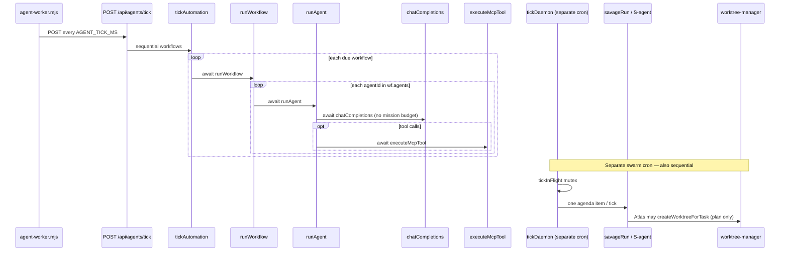

# Prime / Swarm Execution Concurrency Audit

**Repo:** Broser-ai/PraxisOS  
**Branch:** `cursor/prime-execution-control-2c11`  
**Method:** Factual code trace only — no guessing.  
**Date:** 2026-09-03

Trace examined:

`scripts/agent-worker.mjs` → `POST /api/agents/tick` → `lib/agents/workflows.ts` (`tickAutomation` / `runWorkflow`) → `lib/agents/runtime.ts` (`runAgent`) → `lib/agents/llm.ts` / MCP tools  

Parallel surface (separate cron): `/api/cron/swarm-tick` → `lib/swarm/daemon.ts` (`tickDaemon`) → `lib/swarm/meta-harness.ts` → `lib/swarm/s-agents.ts` → `lib/swarm/worktree-manager.ts`  

Prime Execution Control (PR #31 domain, **not yet on the tick path**): `lib/prime/orchestrator.ts` + `mission-store.ts` + `budget-guard.ts`

---

## 1. Concurrency

### How many agent-runs can be active simultaneously?

| Path | Verified behavior |
|------|-------------------|
| Agent worker tick | **One tick request at a time per worker process**; inside the tick, workflows and agents run **sequentially** (`await` in `for` loops). |
| Swarm daemon | **At most one daemon tick** via in-process `tickInFlight` mutex. Each tick runs **one** agenda item → one `savageRun`. |
| Mission Execution Control | Domain allows up to **4** parallel *workstream records* (`MAX_PARALLEL_WORKSTREAMS` = `SWARM_INVARIANTS.MAX_WORKTREES`), but **no dispatcher executes them** on the tick path today. |
| Docker | `docker-compose.praxis.yml` defines a **single** `agent-worker` service (no replicas). |

There is **no** hard cap on concurrent `AgentRun` rows in `lib/agent-store.ts`. Concurrent HTTP clients *could* call `/api/agents/run` or overlapping ticks and create multiple `running` rows — but the **designed** automation path is sequential.

### Promise.all / queues / workers / Redis / Temporal / Inngest?

| Mechanism | Present on agent/swarm tick path? |
|-----------|-----------------------------------|
| `Promise.all` | **No** in `workflows.ts` / `daemon.ts` / `agent-worker.mjs` |
| Queue workers (BullMQ etc.) | **No** |
| `worker_threads` | **No** |
| `child_process` | Only for **git** in worktree managers / atlas plan commit — not agent fan-out |
| Redis / Temporal / Inngest | **No** on this path |

Worker is a plain Node `setInterval` HTTP client:

```16:47:scripts/agent-worker.mjs
async function tick() {
  // ...
  const res = await fetch(`${base}/api/agents/tick`, {
    method: "POST",
    // ...
  });
}
tick();
setInterval(tick, intervalMs);
```

### Mutex / lock / lease?

| Lock | Scope |
|------|--------|
| `state.tickInFlight` in `lib/swarm/daemon.ts` | Swarm daemon only — second `tickDaemon` throws `tick_in_flight` |
| Mission workstream lease | **Missing** (orchestrator spawn only creates records) |
| `/api/agents/tick` | **No mutex** — two concurrent POSTs are allowed by code |

```140:143:lib/swarm/daemon.ts
  if (state.tickInFlight) {
    throw new Error("tick_in_flight");
  }
  state.tickInFlight = true;
```

### Can two ticks run concurrently?

- **Agent automation ticks (`/api/agents/tick`):** **Yes, possible** if two HTTP callers overlap — nothing sets a lock. Inside each tick, work is still sequential.
- **Swarm ticks (`tickDaemon`):** **No** — `tickInFlight` rejects the second call until the first finishes.

What *enforces* sequential agent execution inside one tick:

```333:348:lib/agents/workflows.ts
  for (const wf of WORKFLOWS) {
    // ...
    await runWorkflow(wf.id, { tenant, force: opts?.force });
    ran.push(wf.id);
  }
```

```246:257:lib/agents/workflows.ts
    for (const agentId of wf.agents) {
      const result = await runAgent({
        agentId,
        message: prompt,
        // ...
      });
      runIds.push(result.run.id);
    }
```

---

## 2. Agent spawning

| Question | Answer (code) |
|----------|----------------|
| Which function creates a new agent-run? | `createRun()` in `lib/agent-store.ts`, called from `runAgent()` in `lib/agents/runtime.ts` |
| Which selects persona? | Explicit `agentId`, else `routeMessage()` in `lib/agents.ts`; workflow defs list `agents: AgentId[]` |
| Which starts independent LLM session? | `chatCompletions()` in `lib/agents/llm.ts` (one HTTP chat/completions call per tool-loop round). Not a durable multi-session runtime. |
| Multiple sessions per mission vs same runtime? | Mission `spawnWorkstream` / `spawnDefaultFlow` create **Workstream + MissionAgentRun** records only. Clinic agents share **one Node process** + in-memory `agent-store`. No per-mission process. |
| Personas = processes or prompt names? | **Prompt / config names** (`getAgent`, system prompts, tool allowlists) — not OS processes or worker_threads |

Mission-side “spawn” (records only):

```151:201:lib/prime/orchestrator.ts
export function spawnWorkstream(input: { ... }): Workstream | { error: string } {
  // max parallel check → createWorkstream → optional path conflict → blocked
}
```

---

## 3. Worktrees

| Question | Answer |
|----------|--------|
| Who calls `lib/swarm/worktree-manager.ts` and when? | `atlasCode()` in `lib/swarm/s-agents.ts` via `createWorktreeForTask` during `worktree_exec` / code tasks; also approve/discard/cleanup helpers from meta-harness / admin flows |
| Multiple concurrent worktrees? | Cap = `SWARM_INVARIANTS.MAX_WORKTREES` (**4**). Active/ready jobs counted before create. |
| Coupled to agent execution or only human-gated drafts? | Atlas opens a worktree and writes a **plan markdown + optional commit**, then `markWorktreeReadyForReview`. Merge requires human approve token (`NO_AUTO_MERGE`). Not a full builder LLM coding loop. |
| Non-overlapping file scopes for two builders? | **Not in worktree-manager.** Path non-overlap exists only in **Prime** `detectPathConflict` (`lib/prime/mission-policy.ts`) for mission workstreams — and those workstreams are not executed by the tick dispatcher today. |

```67:76:lib/swarm/worktree-manager.ts
  const active = mem.worktrees.filter((w) => w.status === "active" || w.status === "ready_for_review");
  if (active.length >= SWARM_INVARIANTS.MAX_WORKTREES) {
    return { error: `max_worktrees_${SWARM_INVARIANTS.MAX_WORKTREES}` };
  }
```

---

## 4. Prime

| Question | Answer |
|----------|--------|
| Role of `lib/prime/*` in execution? | **Two layers:** (1) legacy **RLVR quiz / policy proposer** (`agent.ts`, `quiz-pack.ts`, `swarm-bridge.ts` — used by swarm `PRIME_RL` agenda item); (2) **Execution Control domain** (Mission/Budget/DoD/orchestrator) — planner/store/guards, **not** a live multi-agent runtime yet |
| Can Prime call multiple sub-agents? Fan-out/fan-in? | **No live fan-out.** `spawnDefaultFlow` creates scout→builder→verifier→reviewer **records** in a sequential `for` loop. No execute/lease/join. |
| Exact missing integration? | No `dispatcher` on `/api/agents/tick` that: finds approved queued workstreams → **leases** them → runs separate AgentRuns (scout/builder/verifier/reviewer) with controlled concurrency → attaches builder worktrees → records evidence/budget. `runAgent` also does **not** pass `budget` into `chatCompletions` unless a caller supplies mission context (clinic workflows never do). |

---

## 5. Status & evidence

| Question | Answer |
|----------|--------|
| Where are agent-runs persisted? | `lib/agent-store.ts` (memory + optional `PRAXIS_DATA_DIR/agent-store.json` + `agent-runs.jsonl`); mission runs in `lib/prime/mission-store.ts` (`mission-store.json`); swarm tasks/journals in `lib/swarm/memory.ts` / `persist.ts` (+ optional SQL snapshots) |
| Per-run budget/tokens/runtime/toolCalls? | **MissionAgentRun** has `tokenUsage` + `toolCallCount`. **AgentRun** has optional `tokenUsage` fields. BudgetGuard reserve/record works when `chatCompletions({ budget })` is set. Clinic `runAgent` → `llmReply` calls `chatCompletions` **without** `budget` today. |
| Distinguish “Prime thought” vs “builder changed code”? | Swarm journals use `kind: "thought" \| "action" \| "result" \| "gate"`. Atlas builder evidence = worktree plan file + git commit in branch. Mission evidence ledger (`lib/prime/evidence.ts`) tracks commits/files/commands/checks — separate from Prime quiz ledger. |
| Verifier/reviewer separate runs or status/prompt fields? | Today: **Workstream.role** + status fields on mission records. Not separate live AgentRuns unless a dispatcher creates them. Swarm FREJ is a separate S-agent function call, still sequential in the same tick. |

---

## 6. Conclusion (exact format)

**A. Multiple autonomous agents actually running in parallel: NO**

**B. Max verified parallel agent sessions in today's code: 1**  
(Intentional design is sequential `await` chains. Worktree capacity is 4; mission parallel *slots* are 4 — neither is a verified parallel LLM agent session pool.)

**C. Concrete code path that limits parallelism:**

1. `scripts/agent-worker.mjs` — single interval caller  
2. `tickAutomation` / `runWorkflow` — sequential `for` + `await` (`lib/agents/workflows.ts`)  
3. `tickDaemon` — `tickInFlight` mutex + one agenda item per tick (`lib/swarm/daemon.ts`)  
4. Missing mission dispatcher — `spawn*` never schedules execution on tick  

**D. The 3 smallest changes for true multi-agent program execution:**

1. **Dispatcher on tick:** `tickAutomation` (or sibling) claims approved, queued mission workstreams with a **lease/lock**, runs role handlers as separate AgentRuns.  
2. **Controlled concurrency pool (default max 4):** process up to N leased workstreams with a worker pool (not unbounded `Promise.all`); isolate failures; count retries toward rework budget.  
3. **Builder worktree + path scope:** builders get `createWorktreeForTask`; overlapping `changedFiles`/`allowedPaths` → `blocked`; wire `runAgent`/`chatCompletions` with mission `budget` context.

---

## Mermaid — ACTUAL current path



---

## Gap vs PR #31 Execution Control

PR #31 added Mission/BudgetGuard/DoD/API/UI, but **execution remains the sequential clinic tick + sequential swarm daemon**. Completing the BUILD means wiring dispatcher/lease/worker fan-out without weakening clinical invariants (`NO_AUTO_MERGE`, `NO_AUTO_DEPLOY`, `suggestion_only`, `NO_MODEL_TRAINING`, `PATHOLOGY_SHADOW`, no SMS/patient/journal-sign autonomy).
